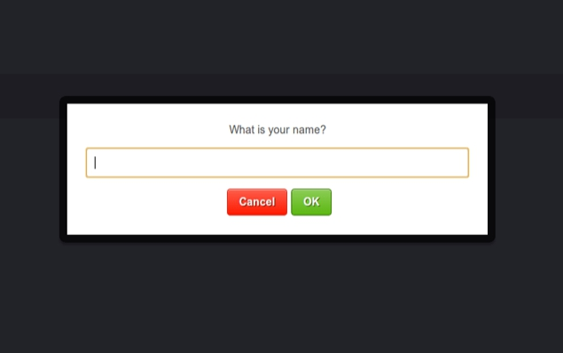
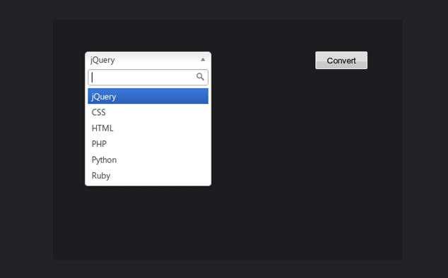
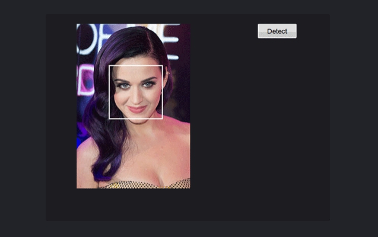
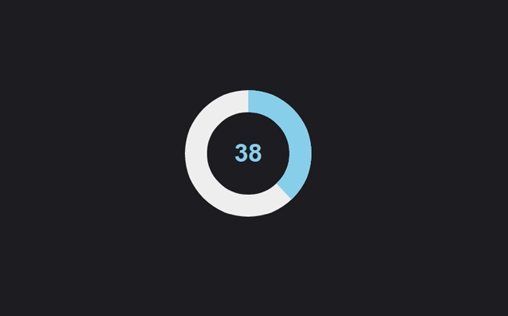
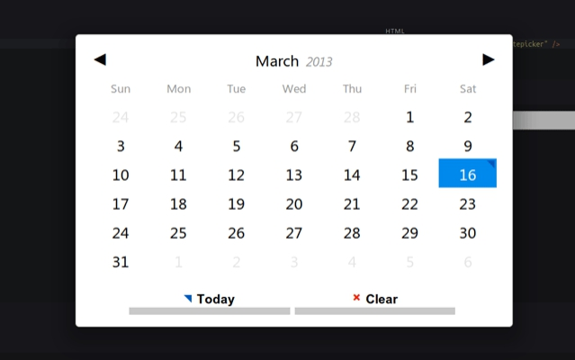
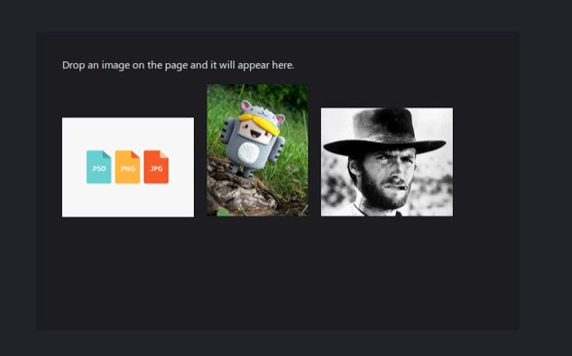
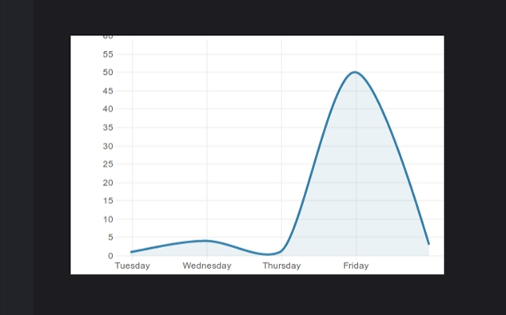

# I. Манипуляции DOM деревом

Зачастую программисты выбирают jQuery за умение манипулировать DOM деревом. Она предоставляет вам дружелюбный CSS синтаксис для выбора элементов, фильтрации, обхода, а также их модификации различными способами. В этой главе мы начнем с базовых приемов и постепенно перейдем к более сложным хитростям.


## 1. Событие ready

Первым шагом к манипулированию DOM является прослушка события ready DOM дерева. Это не только вопрос соглашения — событие срабатывает только когда все элементы страницы отобразились на экране и вы имеете к ним доступ, поэтому при выборе элементов с помощью jQuery вы получите верный результат. Но знаете ли вы, что существует лаконичный способ реализовать это кроссбраузерно и без jQuery? Вот как это делается:

```
// Способы отслеживания события готовности документа

// With jQuery
$(document).ready(function() { /* ... */});

// Short jQuery
$(function() { /* ... */});

// Without jQuery (doesn't work in older IE versions)
document.addEventListener('DOMContentLoaded',function() {
  // Your code goes here
});

// The Trickshot (works everywhere):

r(function() {
  alert('DOM Ready!');
})

function r(f){/in/.test(document.readyState)?setTimeout('r('+f+')',9):f()}
```

[Этот трюк](http://www.dustindiaz.com/smallest-domready-ever) заключается в проверке `document.readyState` свойства. Если оно содержит строку `in` (как в слове Loading), мы устанавливаем таймаут и проверяем снова. В противном случае мы запускаем функцию `f()`.

<a href="examples/001.html" target="_blank">Пример</a>


## 2. Выполнение конкретного кода для определенной страницы

Этот трюк касается только организации кода, но все же хорошо бы его знать. Если вы пишите объемный JavaScript, вскоре его станет тяжело отлаживать и вносить в него изменения. Особенно это актуально, когда большая часть кода содержится в одном файле, который подключается ко всем страницам вашего сайта. В конечном итоге получается так называемый "спагетти-код". Здесь представлен простой способ сохранить ваш код в читабельном состоянии и избежать ошибок. Вам нужно будет написать функцию маршрутизации, которая исполняет соответствующий JS для каждой конкретной страницы.

```
var route = {
  _routes: {}, // Все маршруты будут храниться тут

  add: function(url, action) {
    this._routes[url] = action;
  },

  run: function() {
    $.each(this._routes, function(pattern) {
      if (location.href.match(pattern)) {
        // "this" указывает на вызываемую функцию
        this();
      }
    });
  }
}

// Будет вызвана только на этой странице
route.add('002.html', function() {
  alert('Hello there!')
});

route.add('products.html', function() {
  alert("this won't be executed :(")
});

// Вы можете использовать даже регулярные выражения
route.add('.*.html', function() {
  alert('This is using a regex!')
});

route.run();
```

Каждая функция `action` вызывается в зависимости от текущего `url`.

<a href="examples/002.html" target="_blank">Пример</a>


## 3. Используйте оператор И

Логический оператор И не вычисляет второе выражение, если первое равно `false`. Вы можете использовать это в своих целях и избавить себя от написания полных конструкций `if`:

```
// Вместо этого:
if ($('#elem').length) {
  alert("doing something");
}
// Вы можете написать так:
$('#elem').length && alert("doing something");
```

Лучше всего это работает при проверке отдельных boolean переменных. Использовать такой метод в сложных условных выражениях не рекомендуется, так как это может сделать ваш код трудным для понимания.

<a href="examples/003.html" target="_blank">Пример</a>


## 4. Используйте jQuery метод is()

Метод `is()` мощнее, чем вы думаете. Вот несколько примеров:

html
```
<div id="elem"></div>
```

js
```
// Во-первых, сохраним элемент в переменную
var elem = $('#elem');

// Это div?
elem.is('div') && console.log("это див");

// У него есть класс bigbox?
elem.is('.bigbox') && console.log("у него есть класс bigbox");

// Он видимый? (мы скрыли его в данном примере)
elem.is(':not(:visible)') && console.log("он скрыт");

// Анимируем
elem.animate({'width': 200}, 1);

// Он анимируется?
elem.is(':animated') && console.log("он анимируется");
```

Результат:
```
это див
он скрыт
он анимируется
```

Вы можете передавать любые виды селекторов в метод `is()`. Также в этом примере используется трюк с операторм И из предыдущего совета, благодаря чему, в результате вы получаете три вышеперечисленные строки.

<a href="examples/004.html" target="_blank">Пример</a>


## 5. Определение количества элементов на странице

Чем больше элементов на вашей странице, тем медленнее она загружается. Данный трюк не окажет особого эффекта на скорость загрузки сайта, но это хороший способ проверить число элементов, особенно при редизайне сайта, когда вы хотите сделать ваш новый дизайн компактнее и легче.

Вот как это можно сделать с помощью jQuery:

```
// Сколько элементов содержит данная страница?
console.log('This page has ' + $('*').length + ' elements!');
```

Тут мы просто передаем универсальный селектор (который выбирает все содержимое) в jQuery и определяем число элементов.

<a href="examples/005.html" target="_blank">Пример</a>


## 6. Определение exist() функции

На данный момент, вы наверное, используете свойство `length` объекта jQuery для проверки существования элемента по заданному селектору. Следующий трюк сделает ваш код немного выразительнее и проще для чтения:

html
```
<div id="elem"></div>
```

js
```
// Старый способ:
console.log($('#elem').length == 1 ? "exists!" : "doesn't exist!");

// Новый способ:
jQuery.fn.exists = function() { return this.length > 0 }

console.log($('#elem').exists() ? "exists!" : "doesn't exist!");
```

Со временем вы начнете воспринимать этот метод как встроенный в jQuery по-умолчанию.

<a href="examples/006.html" target="_blank">Пример</a>


## 7. Используйте второй аргумент $() функции

Функция `$()` принимает два параметра. Знаете ли вы зачем нужен второй? Скажем, у нас есть такая вот разметка:

```
<ul id="firstList">
  <li>one</li>
  <li>two</li>
  <li>three</li>
</ul>
<ul id="secondList">
  <li>blue</li>
  <li>green</li>
</ul>
```

Продемонстрируем, зачем нужен этот второй параметр:

```
// Выбор элемента. #firstList является контекстом, ограничивающим поиск.
// Вы можете использовать селектор, jQuery объект или DOM элемент
$('li', '#firstList').each(function() {
  console.log($(this).html());
});

console.log('-----');

// Создание элемента. Второй аргумент
// это объект с jQuery методами, которые будут вызваны.
var div = $('<div>', {
  "class": "bigBlue",
  "css": {
    "background-color": "purple"
  },
  "width" : 20,
  "height": 20,
  "animate": { // Вы можете использовать любой jQuery метод в качестве свойства!
    "width": 200,
    "height": 50
  }
});
div.appendTo('body');
```

Контекст, который мы передаем в первом случае, является грубой альтернативой использованию метода `find()`.

```
$('#firstList').find('li');
```

Второй пример уберегает нас от вызова всех методов по отдельности.

<a href="examples/007.html" target="_blank">Пример</a>


## 8. Выделяйте внешние ссылки с помощью иконок

Для лучшей usability вам возможно понадобится добавить иконку рядом с сылкой, ведущей на другой вебсайт. Это легко сделать с помощью jQuery:

html
```
<ul id="links">
  <li><a href="007.html">The previous tip</a></li>
  <li><a href="./009.html">The next tip</a></li>
  <!-- Внешняя ссылка: -->
  <li><a href="http://www.google.com/">Google</a></li>
</ul>
```

js
```
// Обходим все ссылки
$('#links a').each(function() {
  if (this.hostname != location.hostname) {
    // Это внешняя ссылка
    $(this).append('').attr('target', '_blank');
  }
});
```

Если хотите, можете даже привязать прослушку события `click` по таким ссылкам и уведомлять пользователей о том, куда они ведут.

<a href="examples/008.html" target="_blank">Пример</a>


## 9. Освойте метод end()

Цепочки вызовов - один из самых полезных приемов, который делает jQuery столь эффективной. Метод `end()` мощный инструмент, которым вы можете впечатлить своих друзей. Он занимается тем, что восстанавливает вашу jQuery коллекцию в состояние, которое она принимала до последней модификации (фильтрации, поиска и т.д.) над ней. Пример:

html
```
<ul id="meals">
  <li>
    <ul class="breakfast">
      <li class="eggs">No</li>
      <li class="toast">No</li>
      <li class="juice">No</li>
    </ul>
  </li>
</ul>
```

js
```
var breakfast = $('#meals .breakfast');

breakfast
  .find('.eggs')
  .text('Yes')
  .end() // обратно к breakfast
  .find('.toast')
  .text('Yes')
  .end()
  .find('.juice')
  .toggleClass('juice coffee')
  .text('Yes');

breakfast.find('li').each(function() {
  console.log(this.className + ': ' + this.textContent);
});
```

В результате получаем:

```
eggs: Yes
toast: Yes
coffee: Yes
```

<a href="examples/009.html" target="_blank">Пример</a>


## 10. Предотвращение события click правой кнопкой мыши

Если вы хотите придать вашему веб приложению более естественное поведение, возможно вы захотите отменить клик правой кнопки мыши. Когда происходит клик правой кнопкой мыши, браузеры вызывают событие `contextmenu` и как любое другое событие, вы можете прослушать его и вызвать метод `preventDefault()`. Вот как это работает:

```
$(function() {
  $(document).on("contextmenu", function(e) {
    e.preventDefault();
  });
});
```

Вы можете пойти дальше и отобразить полноценное пользовательское контекстное меню, используя координаты, которые передаются в качестве свойств у объекта события `e`.
<a href="examples/010.html" target="_blank">Пример</a>


## 11. Вырывание из iframe

Некоторые сайты такие как StumbleUpon или Linkedin отображают ваш сайт вместе с их баром сверху страницы. Это сделано включением вашей страницы в `iframe`. Вот как вы можете это убрать:

```
if (window != window.top) {
  window.top.location = window.location;
}
```

Вам просто нужно сравнить объект `window` вашей страницы с объектом `window.top`. Обычно, они одинаковы, но если ваш сайт отображается внутри `iframe`, они будут отличаться. Затем вы просто перенаправляете браузер прямо на ваш сайт.

<a href="examples/011.html" target="_blank">Пример</a>


## 12. Разбор URL адресов с помощью ссылок

Разбор `url` на части — это серьезная заноза в заднице. Возможно, вашей первой мыслью будет найти регулярное выражение, которое сделает это. Но существует более простой способ — использование гиперссылок!

```
// Вы хотите разобрать этот адрес на части:
var url = 'http://tutorialzine.com/books/jquery-trickshots?trick=12#comments';
// Создайте новую ссылку со значением url в атрибуте href:
var a = $('<a>', {href: url});
console.log('Host name: ' + a.prop('hostname'));
console.log('Path: ' + a.prop('pathname'));
console.log('Query: ' + a.prop('search'));
console.log('Protocol: ' + a.prop('protocol'));
console.log('Hash: ' + a.prop('hash'));
```

Браузер автоматически распарсит адрес и присвоит свойствам объекта ссылки соответствующие части `url`. Результатом будет то, что вы получите всю сложную работу в готовом виде:

```
Host name: tutorialzine.com
Path: /books/jquery-trickshots
Query: ?trick=12
Protocol: http:
Hash: #comments
```

<a href="examples/012.html" target="_blank">Пример</a>


## 13. Сделай свою таблицу стилей редактируемой

Эта забавная хитрость покажет вам, что вы можете манипулировать встроенными блоками стилей точно также, как другими элементами. Они могут быть видимыми и даже редактируемыми с помощью небольшого jQuery сниппета.
Например, давайте предположим, что у нас есть следующая встроенная таблица (внутри тега `body`):

```
<style id="regular-style-block">
  html {
    background-color: #222229;
    position: relative;
  }
  body {
    font: 14px/1.3 'Segoe UI', Arial, sans-serif;
    color: #e4e4e9;
    min-height: 500px;
  }
</style>
```

Чтобы сделать этот блок видимым и редактируемым, запустите этот код в консоли:

```
$('#regular-style-block')
  .css({'display': 'block', 'white-space': 'pre'})
  .attr('contentEditable', true);
```

Изменения, которые вы внесете в эту таблицу стилей сразу же отразятся на вашей странице.
<a href="examples/013.html" target="_blank">Пример</a>


## 14. Отмена выделения текста

В определенной ситуации вам возможно захочется сделать так, чтобы текст на странице нельзя было выделить. Это полезно при создании интерфейсов позволяющих перемещать или переупорядочивать элементы страницы. И вы не хотите, чтобы пользователи случайно выделяли текст страницы. Ниже представлен сниппет, который выполняет эту функцию и работает во всех браузерах:

```
$('p.descr')
  .attr('unselectable', 'on')
  .css('user-select', 'none')
  .on('selectstart', false);
```


# II. Производительность

Веб-разработчики должны не только создавать работающие сайты, но и делать их быстрыми. Никому не нравятся страницы, которые бесконечно загружаются. В этой главе вы найдете советы и трюки по тому, как сделать ваш JavaScript быстрее и как ускорять ваши веб-приложения в дальнейшем. Если вы готовы, читайте дальше.

<a href="examples/014.html" target="_blank">Пример</a>


## 15. Подключение jQuery из CDN

Лучшее, что можно сделать в первую очередь для увеличение производительность JavaScipt вашего веб-сайта — просто подключить последнюю версию jQuery, так как каждый новый релиз несет за собой больше оптимизации и исправленных багов. Получение jQuery из CDN также хорошее решение, так как это минимизирут время загрузки вашего сайта (CDN быстрее передает библиотеку и многие пользователи могут хранить ее у себя в кэше).

```
<!-- Вариант 1 - запрос jQuery с официального CDN -->
<script src="http://code.jquery.com/jquery-1.10.2.min.js"></script>
<!-- Вариант 2 - запрос jQuery с Google CDN (обратите внимание на протокол) -->
<script src="//ajax.googleapis.com/ajax/libs/jquery/1.10.2/jquery.min.js"></script>
<!-- Вариант 3 - запрос последних незначительных изменений 1.10.x (кэшируется только на час) -->
<script src="//ajax.googleapis.com/ajax/libs/jquery/1.10/jquery.min.js"></script>
<!-- Вариант 4 - запрос самой последней версии jQuery (используйте с осторожностью) -->
<script src="http://code.jquery.com/jquery.min.js"></script>
```

Помимо подключения конкретной версии библиотеки, вы можете выбрать конкретную версию с незначительными последними изменениями доступными на данный момент или даже запросить абсолютно новую версию jQuery. Используйте последний вариант с осторожностью, поскольку ваш код может перестать работать, если существуют критические изменения между последними релизами.

<a href="examples/015.html" target="_blank">Пример</a>


## 16. Обращайтесь к DOM как можно меньше

Несмотря на все достижения в производительности JavaScript, манипуляции с DOM все еще догоро обходятся и должны быть сведены к минимуму. Это особенно важно во время одновременной вставки большого количества элементов на страницу:

html
```
<div id="elem"></div>
```

js
```
// Плохо
var elem = $('#elem');
for (var i = 0; i < 100; i++) {
  elem.append('<li>element ' + i + '</li>');
}

// Хорошо
var elem = $('#elem'),
arr = [];
for (var i = 0; i < 100; i++) {
  arr.push('<li>element ' + i + '</li>');
}
elem.append(arr.join(''));
```

Группировка вставок в одну операцию быстрее, так как DOM перерисовывается только однажды. То же касается стилевых свойств: лучше назначить один css класс, чем применять несколько стилей.

<a href="examples/016.html" target="_blank">Пример</a>


## 17. Не бойтесь использовать нативный JS

Создание нового jQuery объекта несет за собой накладные расходы. Поэтому, если вы думаете о производительности, вам следует использовать нативный JavaScript там, где это возможно. Иногда, это даже проще и требует меньше кода. Вот пример:

```
// Выводим id всех лишек
$('#colors li').each(function() {
  // Добираемся к id напрямую, вместо использования jQuery $(this).attr('id')
  console.log(this.id);
});
```

Там, где производительность играет важнейщую роль, например, игры, canvas манипуляции или другие вычисления, избегайте jQuery и используйте нативные `for` циклы.

<a href="examples/017.html" target="_blank">Пример</a>


## 18. Оптимизируйте ваши селекторы

Если вам нужно немного дополнительной производительности, но вы хотите использовать jQuery, вам следует попытаться оптимизировать ваши селекторы. Здесь используются time и timeEnd методы консоли вашего браузера (больше информации о трюках с консолью смотрите в пункте 47) для измерения времени работы кода.

html
```
<div id="peanutButter">
  <div id="jelly" class="jellyTime"></div>
</div>
```

js
```
// Давайте проведем несколько измерений!
var iterations = 10000, i;
console.time('Fancy');
for (i = 0; i < iterations; i++) {
  // Это очень медленный способ обойти элементы DOM
  $('#peanutButter div:first');
}
console.timeEnd('Fancy');

console.time('Parent-child');
for (i = 0; i < iterations; i++) {
  // Лучше, но все равно медленно
  $('#peanutButter div');
}
console.timeEnd('Parent-child');

console.time('Parent-child by class');
for (i = 0; i < iterations; i++) {
  // Дле некоторых браузеров такой подход немного быстрее
  $('#peanutButter .jellyTime');
}
console.timeEnd('Parent-child by class');

console.time('By class name');
for (i = 0; i < iterations; i++) {
  // Еще лучше
  $('.jellyTime');
}
console.timeEnd('By class name');

console.time('By id');
for (i = 0; i < iterations; i++) {
  // Самый лучший
  $('#jelly');
}
console.timeEnd('By id');
```

Запуск этого примера в современном браузере приведет к примерно следующему результату:
Данные говорят о том, что выбор элемента по `id` в несколько раз быстрее остальных. И более сложные селекторы замедляют работу. Конечно, если вы ищете элемент только один раз, особой разницы в производительности вашего приложения вы не заметите. Но вам следует использовать другие трюки — кэширование jQuery объектов.

<a href="examples/018.html" target="_blank">Пример</a>


## 19. Используйте кэширование

Каждый раз, когда вы создаете новый объект jQuery, передавая селектор элемента, jQuery обходит DOM и связывает этот селектор с реальным элементом страницы. Это довольно медленный процесс в JavaScript, но ситуация меняется в лучшую сторону при использовании современных браузеров, которые поддерживают функцию `document.querySelector`, возвращающую элементы напрямую связанные с CSS селекторами. К сожалению, проблема остается актуальной в таких браузерах как IE8 и более ранних версиях. Хорошей практикой является повторное использование объектов jQuery, предварительно сохранив их в переменную.

html
```
<ul id="pancakes">
  <li>first</li>
  <li>second</li>
  <li>third</li>
  <li>fourth</li>
  <li>fifth</li>
</ul>
```

js
```
// Плохой способ:
// $('#pancakes li').eq(0).remove();
// $('#pancakes li').eq(1).remove();
// $('#pancakes li').eq(2).remove();

// Хороший:
var pancakes = $('#pancakes li');
pancakes.eq(0).remove();
pancakes.eq(1).remove();
pancakes.eq(2).remove();

// Альтернативный:
// pancakes.eq(0).remove().end()
// .eq(1).remove().end()
// .eq(2).remove().end();
```

Это не только увеличивает производительность вашего приложения, но также делает ваш код более понятным и поддерживаемым.

<a href="examples/019.html" target="_blank">Пример</a>


## 20. Определяйте повторяющуюся функцию только один раз

Еще один оптимизационный момент, который вы должны знать, заключается в том, чтобы определять функции-слушатели до того, как привязывать их к нескольким элементам, а затем передавать их в качестве переменных.

html
```
<button id="menuButton">Show Menu!</button>
<a href="#" id="menuLink">Show Menu!</a>
```

js Пример 1
```
// Это приводит к множественному копированию callback-функции в памяти
$('#menuButton, #menuLink').click(function() {
  // ...
});
```

js Пример 2
```
// Так лучше:
function showMenu(){
  alert('Showing menu!');
  // Тело слушателя
}
$('#menuButton').click(showMenu);
$('#menuLink').click(showMenu);
```

Если вы определяете callback-функцию так, как показано в первом примере и jQuery объект содержит больше одного элемента, копии функции сохранятся в памяти для каждого элемента коллекции.

<a href="examples/020.html" target="_blank">Пример</a>


## 21. Обрабатывайте jQuery объекты как массивы

Возможно вы не знали, но использование элегантного jQuery метод `each` не самое лучшее решение, если вы думаете о производительности. Этот трюк позволяет перебирать объект jQuery намного быстрее. Просто воспринимайте его как самый обычный массив. У объекта есть свойство `length` и каждый элемент имеет свой индекс.

html
```
<ul id="testList">
  <li>Item</li>
  <li>Item</li>
  <li>Item</li>
  <li>Item</li>
  <li>Item</li>
  <li>Item</li>
  <li>Item</li>
  <li>Item</li>
  <li>Item</li>
  <!-- и так далее -->
</ul>
```

js
```
var arr = $('li'),
  iterations = 100000;

console.time('Native Loop');
for (var z = 0; z < iterations; z++) {
  var length = arr.length;
  for (var i = 0; i < length; i++) {
    arr[i];
  }
}
console.timeEnd('Native Loop');

console.time('jQuery Each');
for (z = 0; z < iterations; z++) {
  arr.each(function(i, val) {
    this;
  });
}
console.timeEnd('jQuery Each');
```

Нативный цикл может быть в 5 раз быстрее метода `each()`! Внутри циклов мы не делаем ничего особенного - просто обращаемся к DOM элементам. Если вам потребуется что-то более вычислительно сложное, разница между `$.each()` и `for()` будет менее заметна, так как интерпретатор будет тратить большую часть своего времени на то, что содержится внутри циклов.

<a href="examples/021.html" target="_blank">Пример</a>


## 22. Отделяйте элементы, если производите сложные модификации над ними

Модификация DOM элемента требует перерисовки страницы для каждого изменения стиля, которое может вам дорого стоить. Если вы хотите сэкономить каждую частичку производительности, можете попробовать отделить элемент от страницы на время его интенсивной модификации.

html
```
<div id="elem" style="background:blue"></div>
```

js
```
var i = 0, iterations = 1000;

// Изменяем элемент на месте
var elem = $('#elem');

console.time('In place');
for (i = 0; i < iterations; i++) {
  elem.width(Math.round(100*Math.random()));
  elem.height(Math.round(100*Math.random()));
}
console.timeEnd('In place');

var parent = elem.parent();

// Теперь сначала отделяем его от DOM
console.time('Detached');
elem.detach();
for (i = 0; i < iterations; i++) {
  elem.width(Math.round(100*Math.random()));
  elem.height(Math.round(100*Math.random()));
}
elem.appendTo(parent);
console.timeEnd('Detached');
```

Отделение элементов может ускорить ваш код в два раза. Это касается не только ширины и высоты - изменение любого стиля или содержания вызывает перерисовку элемента или даже целой страницы.

<a href="examples/022.html" target="_blank">Пример</a>


## 23. Не ждите загрузки страницы

Мы привыкли располагать весь наш код внутри обработчика событий `$(document).ready()`. Однако, если у нас тяжелая страница, готовность документа может задержаться. Но существует обходной путь, который улучшает отзывчивость страницы — использование делегирование событий, мы можем привязать событие, даже если страница еще не загружена:

```
// jQuery уже загружен. Прямо сейчас мы можем использовать
// делегирование события, чтобы привязать события
// даже перед $(document).ready():
$(document).on('click', '#clickMe', function() {
  alert('Hey handsome!');
});
$(document).ready(function() {
  // Это то место, куда вы обычно помещаете обработчики
  // но поскольку мы используем делегирование в этом нет нужды.
  // $('#clickMe').click(function() { alert('Hey!'); });
});
```

За пределами `document.ready()` вы можете инициализировать объекты, производить вычисления, запускать Ajax запросы и многое другое.

<a href="examples/023.html" target="_blank">Пример</a>


## 24. Создавайте таблицы стилей, если стилизуете множество элементов

Как мы раньше упоминали, манипуляции с DOM достаточно медленны. Один из способов решить эту проблему в случае, если вам нужно изменить стили — создание таблицы стилей с последующей вставкой ее в документ.

html
```
<ul id="testList">
  <li>Item</li>
  <li>Item</li>
  <li>Item</li>
  <li>Item</li>
  <li>Item</li>
  <li>Item</li>
  <li>Item</li>
  <li>Item</li>
  <li>Item</li>
  <!-- и так далее -->
</ul>
```

js
```
var style = $('<style/>');
// Добавляем стили в качестве содержимого тега:
style.text('#testList li { color: red; font-size: 20px; }');
// Располагаем их в самом начале body, чтобы они подействовали на элементы
style.prependTo('body');
```

Это быстрее, потому что браузеры определяют, когда нужно перерисовать DOM и сразу обновляют все элементы. А обходя все элементы в цикле и обновляя их стили, вы просто не сможете получить подобного результата.


# III. События

Простая реализация прослушки событий — еще одна причина, по которой jQuery является одной из самых популярных JavaScript библиотек. Ни одно современное веб-приложение не обходится без этого инструмента. В этой главе я представлю вам ряд советов и трюков, как лучше использовать функционал jQuery для решения реальных проблем, с которыми вы можете столкнуться, и сохранить при этом ваше время.

<a href="examples/024.html" target="_blank">Пример</a>


## 25. Привяжите "JS" класс к тегу html

Веб-приложения часто зависят от большого количества JavaScript кода для взяимодействия с пользователем. Однако JavaScript может быть отключен или недоступен. В этом случае вы, по крайней мере, можете убедиться, что ваше приложение может использоваться. Существует простой способ сделать это - в событии `load` привяжите класс к тегу `html`. Затем с помощью CSS отобразите на странице особые элементы, которые зависят от JavaScript только когда имеется данный класс.

css
```
#message { display:none; }
html.js #message { display:block; }
```

html
```
<p id="message">
  This is a message that is only shown when JavaScript is available.
</p>
```

js
```
// Это все, что нам нужно!
$(document).ready(function() {
  $('html').addClass('js');
});
```

Вы можете использовать эту технику не только для того, чтобы скрывать элементы, но и полностью изменять поведение вашего сайта, в зависимости от возможностей устройства (Более подробную информацию об определении возможностей браузера смотрите в 65 пункте).

<a href="examples/025.html" target="_blank">Пример</a>


## 26. Прослушка событий на элементах, которые еще не существуют

Новички часто ловят себя на том, что, когда они вставляют новые элементы на страницу, слушатели событий перестают работать. jQuery содержит отличный механизм обработки событий, доступный через метод `on()`, который может решить эту проблему при помощи делегирования событий (к тому же это может увеличить производительность вашего сайта, как говорилось в пункте 23).

html
```
<ul id="testList">
  <li>Old</li>
  <li>Old</li>
  <li>Old</li>
  <li>Old</li>
</ul>
```

JS
```
var list = $('#testList');

// Привязываем слушателя к списку, но прослушиваем события на элементе li
list.on('click', 'li', function() {
  $(this).remove();
});

// Это позволяет нам создавать элементы и сохранять исправность работы слушателя
list.append('<li>New item (click me!)</li>');
```

Прослушка событий устанавливается на `#testList`, но так как события в DOM имеют свойство всплывать, события, произошедшие в дочернем элементе `li`, также возникают и в родительском узле.

<a href="examples/026.html" target="_blank">Пример</a>


## 27. Одиночный вызов обработчика событий

Иногда бывает нужно привязать обработчик событий, который отработает только один раз. jQuery поможет вам в этом — используйте метод `one()`.

html
```
<button id="press">Press me!</ul>
```

js
```
var press = $('#press');

// Это метод который сработает только единожды:
press.one('click', function() {
  alert('This alert will pop up only once');
});
```

Внутри себя этот метод вызывает метод `on()` с 1 в качестве последнего аргумента:

```
press.on('click', null, null, function() { alert('I am the one and only!'); }, 1);
```

Это всего лишь реализационная деталь, поэтому вам не следует использовать такой подход в своем коде, так как все может поменяться в последующих версиях.

<a href="examples/027.html" target="_blank">Пример</a>


## 28. Симуляция событий

Помимо прослушки событий jQuery предоставляет вам простой способ их вызова. Это может быть удобно при использовании чужого кода, который не содержит правильного API. Например, вы можете эмулировать клик по стрелкам слайдера прямо из своего кода.

html
```
<button id="press">Press me!</ul>
```

js
```
var press = $('#press');

// Обычный обработчик события
press.on('click', function(e, how) {
  how = how || '';
  alert('The buton was clicked ' + how + '!');
});

// Эмуляция клика
press.trigger('click');

// Эмуляция клика с аргументом
press.trigger('click', ['fast']);
```

Это будет выглядеть, как обычное нажатие на кнопку. Вы даже можете передать дополнительные параметры в обработчик события, которые будут доступны через аргумент в `callback` функции.

<a href="examples/028.html" target="_blank">Пример</a>


## 29. Работа с touch событиями

Однажды прикосновения станут главным способом взаимодействия с веб-сайтами. Работа с такими событиями не сильно отличается от соответствующих событий мышкой. Нажатия и наведения уже симулируются мобильными браузерами, но если вам нужна более продвинутая функциональность, такая как определение жестов или перетаскивание, вам придется сделать немного дополнительной работы.

Посмотрите пример ниже:

js
```
// Определим несколько переменных
var ball = $('<div id="ball"></div>').appendTo('body'),
  startPosition = {},
  elementPosition = {};

// Установим mouse и touch события
ball.on('mousedown touchstart', function(e) {
  e.preventDefault();

  // Нормализуем объект события touch
  e = (e.originalEvent.touches) ? e.originalEvent.touches[0] : e;

  // Записываем текущую позицию
  startPosition = {x: e.pageX, y: e.pageY};
  elementPosition = {x: ball.offset().left, y: ball.offset().top};

  // Эти обработчики событий будут удалены позже
  ball.on('mousemove.rem touchmove.rem', function(e) {
    e = (e.originalEvent.touches) ? e.originalEvent.touches[0] : e;
    ball.css({
      top:elementPosition.y + (e.pageY - startPosition.y),
      left: elementPosition.x + (e.pageX - startPosition.x)
    });
  });
});

ball.on('mouseup touchend', function() {
  // Удобное удаление *move слушателей
  ball.off('.rem');
});
```

Вы должны следить за соответствующими mouse и touch событиями. Обратите внимание, что я устанавливаю `mousemove` и `touchmove` события только, когда начинается перенос, а после удаляю их. Это достаточно дорогие, в плане производительности, функции и постоянно держать их активными не самое лучшее решение.
В итоге вы получили код, позволяющий перемещать мяч по всему экрану на любых устройствах. Для определения жестов можете воспользоваться такой библиотекой, как `hammer.js`

<a href="examples/029.html" target="_blank">Пример</a>


## 30. Знай свои события

jQuery упростил обработку событий в версии 1.7, добавив методы `on()` и `off()`. Они уже привнесли ряд трюков, но знаете ли вы, как их правильно использовать?

html
```
<div id="holder">
  <button id="button1">1</button>
  <button id="button2">2</button>
  <button id="button3">3</button>
  <button id="button4">4</button>
  <button id="clear" style="float: right;">Clear</button>
</div>
```

js
```
// Давайте сохраним несколько элементов
var button1 = $('#button1'),
  button2 = $('#button2'),
  button3 = $('#button3'),
  button4 = $('#button4'),
  clear = $('#clear'),
  holder = $('#holder');

// Вариант 1: Прямая обработка события
button1.on('click', function() {
  console.log('Click');
});

// Вариант 2: Прямая обработка множества событий
button2.on('mouseenter mouseleave', function() {
  console.log('In/Out');
});

// Вариант 3: Передача данных
button3.on('click', Math.round(Math.random() * 20), function(e) {
  // Здесь будет выводиться одно и то же число раз за разом,
  // так как случайное число генерируется только один раз:
  console.log('Random number: ' + e.data);
});

// Вариант 4: События с пространством имен
button4.on('click.temp', function(e) {
  console.log('Temp event!');
});

button2.on('click.temp', function(e) {
  console.log('Temp event!');
});

// Вариант 5: Делегирование событий
$('#holder').on('click', '#clear', function() {
  // Этот обработчик реагирует только на клик по кнопке
  // с идентификатором clear, которая расположена внутри #holder:
  console.clear();
});

// Вариант 6: Передача карты событий
var t; // таймер
clear.on({
  mousedown: function() {
    t = new Date();
  },
  mouseup: function() {
    if (new Date() - t > 1000) {
      // Еслки кнопка удерживается больше секунды.
      // Отлючаем события с пространством имен .temp
      $('button').off('.temp');
      alert('The .temp events were cleared!');
    }
  }
});
```

Метод `on()` объединяет старые `bind()`, `live()` и `delegate()` в один, и вам следует начать использовать именно его. Более старые методы, такие как `click()` все еще доступны.

<a href="examples/030.html" target="_blank">Пример</a>


## 31. Отмена действий по-умолчанию у событий

Вы вероятно знакомы с методом `preventDefault()`, вызываемым у объекта события внутри слушателя. Он останавливает браузер в выполнении действий по-умолчанию, таких как переход по ссылке, отправка формы, выбор checkbox'ов и т. д. Также существует метод `stopPropagation()`, предотвращающий всплытие событий в DOM дереве. Вернув `false`, вы можете вызвать оба этих метода. Однако существует более короткий способ.

html
```
<a href="http://google.com/" id="goToGoogle">Go To Google</a>
```

js
```
// Вместо этого:
$('#goToGoogle').click(function() {
  return false;
});

// Вы можете сделать так:
$('#goToGoogle').click(false);
```

Вам не нужно писать всю функцию. Просто передайте `false` в качестве единственного аргумента.

<a href="examples/031.html" target="_blank">Пример</a>


## 32. Связывайте обработчики событий с помощью event.result

Нередко возникает потребность в том, чтобы привязать более одного обработчика событий к одному и тоже же элементу. С помощью `event.result` вы можете передать данные от одного обработчика другому, словно связав их вместе.

html
```
<button id="press">Press me!</button>
```

js
```
var press = $('#press');

press.on('click', function() {
  return 'Hip';
});

// Второй обработчик событий имеет доступ
// к тем данным, что вернул первый
press.on('click', function(e) {
    console.log(e.result + ' Hop!');
});
```

Эта техника может оказаться довольно полезной при передаче состояния и других аргументов между функциями.

<a href="examples/032.html" target="_blank">Пример</a>


## 33. Создавайте настраиваемые события

Вы можете использовать инфраструктуру обработки событий jQuery в своих интересах. Вы можете передать свои собственные, настроенные события и привязать их, используя стандартные методы `on` и `off`. Некоторые авторы называют это `Pub/Sub` паттерном:

html
```
<button id="button1">Jump</button>
<button id="button2">Punch</button>
<button id="button3">Click</button>
<div id="eventDiv"></div>
```

js
```
var button1 = $('#button1'),
  button2 = $('#button2'),
  button3 = $('#button3'),
  div = $('#eventDiv');

div.on({
  jump: function() {
    console.log('Jumped!');
  },

  punch: function(e, data) {
    console.log('Punched ' + data + '!');
  },

  click: function() {
    console.log('Simulated click!');
  }
});

button1.click(function() {
  div.trigger('jump');
});

button2.click(function() {
  // Передаем даные вместе с событием
  div.trigger('punch', ['hard']);
});

button3.click(function() {
  div.trigger('click');
});
```

Нажимая по очереди на эти кнопки, мы получим следующий результат:

```
Jumped!
Punched hard!
Simulated click!
```

Эта техника позволит выделить в вашем коде действия, независящие от обработки событий вашего интерфейса.


# IV. AJAX

Ajax — это существенный блок построения веб-приложений. Он позволяет отправлять только те данные, которые вам нужны, сохраняя пропускную способность и ускоряя работу ваших сайтов. В этой главе, я покажу вам ряд трюков, которые можно использовать для улучшения ваших приложений и объясню несколько вещей, появившихся в новых версиях jQuery.

<a href="examples/033.html" target="_blank">Пример</a>


## 34. Отображайте размеры файлов рядом со ссылкой на скачивание

Вы знали, что можно отправить HEAD запрос с помощью Ajax и получить размер файла без его загрузки? С jQuery это очень просто:

html
```
<a href="001.html" class="fetchSize">First Trickshot</a>
<a href="034.html" class="fetchSize">This Trickshot</a>
<a href="ball.png" class="fetchSize">Ball.png</a>
```

js
```
// Обходим все ссылки с классом .fetchSize
$('a.fetchSize').each(function() {
  // Отправляем Ajax HEAD запрос для каждой ссылки
  var link = this;

  $.ajax({
    type: 'HEAD',
    url: link.href,
    complete: function(xhr) {
      var size = humanize(xhr.getResponseHeader('Content-Length'));

      // Вставляем размер файла
      $(link).append(' (' + size + ')');
    }
  });
});

function humanize(size) {
  var units = ['bytes', 'KB', 'MB', 'GB', 'TB', 'PB'];

  var ord = Math.floor(Math.log(size) / Math.log(1024));
  ord = Math.min(Math.max(0, ord), units.length - 1);

  var s = Math.round((size / Math.pow(1024, ord)) * 100) / 100;
  return s + ' ' + units[ord];
}
```

Этот фрагмент кода располагает размер файла рядом с его именем. Данный скрипт отправляет HEAD запрос, который возвращает только заголовки без какого-либо содержимого файла. А это значит, что такие запросы быстрые и легкие.

```
First Trickshot (871 bytes)
This Trickshot (1.27 KB)
Ball.png (12.49 KB)
```

<a href="examples/034.html" target="_blank">Пример</a>


## 35. Упрощайте свои Ajax запросы с помощью deferreds

Deferreds — это мощный инструмент. jQuery возвращает новый объект deferred при каждом Ajax запросе, который упращает с ним работу. Ниже показано, как можно сделать свой код более читабельным, использую `deferreds`.

```
// Это то же самое, что передать callback в качестве
// второго аргумента (успешное выполнение):
$.get('1.json').done(function(r) {
  console.log(r.message);
});

// Запрос файла, которого не существует. Это вызовет
// неудачный ответ. Для его обработки обычно
// используется полный метод $.ajax с передачей callback функции
// обработки неудачных ответов,
// но с deferreds вы можете просто использовать метод fail:
$.get('non-existing.json').fail(function(r) {
  console.log('Oops! The file is missing!');
});
```

Как вы увидите в 55 пункте, `deferreds` несут за собой множество мощных способностей.

<a href="examples/035.html" target="_blank">Пример</a>


## 36. Запускайте множественные Ajax запросы параллельно

При работе с API иногда возникает потребность выполнить множество Ajax запросов в разные конечные точки. Вместо того, чтобы ждать окончания одного запроса перед тем, как выполнить следующий, можно ускорить этот процесс с помощью jQuery, запросив данные параллельно, используя jQuery метод `$.when()`:

```
$.when($.get('1.json'), $.get('2.json')).then(function(r1, r2) {
  console.log(r1[0].message + " " + r2[0].message);
});
```

`callback` выполнится только после того, как оба `GET` запроса успешно финишируют. `$.when()` принимает `promises`, возвращенные двумя вызовами `$.get()` и создает новый объект promise. Аргументы `callback` функции `r1` и `r2` — это массивы, в которых первый элемент содержит ответ сервера.

<a href="examples/036.html" target="_blank">Пример</a>


## 37. Получайте ваш IP с помощью jQuery

Вы знали, что можете получить свой внешний IP адрес всего в одной строке JS? Существует бесплатный сервис, который предлагает вам эту услугу. Все, что вам нужно сделать — отправить `get` запрос.

```
$.get('http://jsonip.com/', function(r) { console.log(r.ip); });
```

Для работы этого кода нужно, чтобы ваш браузер поддерживал CORS (`cross-origin request sharing`). В противном случае будет выброшено исключение безопасности. В более старых браузерах, можно использовать версию, которая использует JSON-P запрос:

```
$.getJSON('http://jsonip.com/?callback=?', function(r) { console.log(r.ip); });
```

<a href="examples/037.html" target="_blank">Пример</a>


## 38. Самый простой Ajax запрос

jQuery предлагает короткий метод для быстрой загрузки контента в элемент при помощи Ajax — метод `$.load()`.

html
```
<p class="content"></p>
<p class="content"></p>
```

js
```
var contentDivs = $('.content');

// Возьмем содержимого текстового файла:
contentDivs.eq(0).load('1.txt');

// Берем содержимое HTML файла и отображаем элемент с id header
contentDivs.eq(1).load('1.html #header');
```

В отличие от остальных Ajax запросов, тут вы можете указать CSS селектор, который ограничит результат. К тому же данные не возвращаются, а непосредственно заменяют содержимое элемента.

<a href="examples/038.html" target="_blank">Пример</a>


## 39. Сериализация объектов

Если вы серьезно относитесь к Ajax, вы должны быть знакомы с jQuery методами для кодирования форм и простых объектов. Результатом является дружелюбное URL представление, которое можно вставить в Ajax запрос. Ниже показано, как их использовать:

html
```
<form id="gform">
  <input type="text" name="performer" value="Gangnam K. Style">
  <input type="text" name="email" value="psy@w3c.org">
  <textarea name="lyrics">Na je nun ta sa ro un in gan jo gin yo ja</textarea>
</form>
```

js
```
var form = $('#gform');

// Оборачиваем все поля формы в url строку вида: ключ=значение
// Она может быть передана в качестве аргумента Ajax запроса или URL
console.log(form.serialize());

console.log('---------');

// Также вы можете закодировать свой собственный объект с помощью метода $.param
console.log($.param({'pet': 'cat', 'name': 'snowbell'}));

console.log('---------');

// Используя $.serializeArray(), можно закодировать форму в объект
console.log(form.serializeArray());
```

Результат:
```
performer=Gangnam+K.+Style&email=psy
%40w3c.org&lyrics=Na+je+nun+ta+sa+ro+un+in+gan+jo+gin+yo+ja
---------
pet=cat&name=snowbell
---------
[{
  "name": "performer",
  "value": "Gangnam K. Style"
}, {
  "name": "email",
  "value": "psy@w3c.org"
}, {
  "name": "lyrics",
  "value": "Na je nun ta sa ro un in gan jo gin yo ja"
}]
```

Часто эти преобразования производятся "за сценой", когда вы используете объект в качестве аргумента одного из Ajax методов.

<a href="examples/039.html" target="_blank">Пример</a>


## 40. Загрузка файлов с jQuery

Современные браузеры поддерживают [FormData API](https://developer.mozilla.org/en-US/docs/Web/API/FormData), которое позволяет отправлять двоичные данные просто через Ajax. Комбинируя это с [HTML5 File API](http://www.html5rocks.com/en/tutorials/file/dndfiles/), можно получить простой способ загрузки файлов без использования каких-либо дополнительных плагинов.
Идея заключается в том, чтобы получить ссылку на файл через `input` типа `file`. Затем мы создаем новый объект `FormData` и вставляем в него эту ссылку. Ну и, наконец, передаем объект `FormData` прямо в Ajax метод. Последним шагом нам нужно будет установить два свойство этого объекта в `false`, чтобы jQuery не обрабатывал эти данные.

html
```
<input type="file">
<button id="upload">Upload it!</button>
```

js
```
var fileInput = $('input[type=file]'),
  button = $('#upload');

button.on('click', function() {
  // Обращаемся к свойству files, которое содержит
  // массив выбранных файлов

  var files = fileInput.prop('files');

  // Выбранных файлов нет!
  if (files.length == 0) {
    alert('Please choose a file to upload!');
    return false;
  }

  // Создаем новый объект FormData
  var fd = new FormData();

  fd.append('file', files[0]);

  // Загружаем файл в assets/php/upload.php, который просто выводит имя файла

  $.ajax({
    url: './assets/php/upload.php',
    data: fd,
    contentType: false,
    processData: false,
    type: 'POST',
    success: function(m) {
      console.log(m);
    }
  });
});
```

Доступ к свойству `files` файлового поля ввода возвращает нам массив объектов файлов от HTML5 File API. Мы можем добавить их в объект `FormData` и привязать к свойству запроса `data`. Хитрость заключается в том, чтобы настройки `contentType` и `processData` были равны `false`. Так jQuery не будет пытаться сериализовать данные (что только поломает запрос), а оставит их браузеру. И не нужно никаких плагинов!

<a href="examples/040.html" target="_blank">Пример</a>


## 41. Работа с графом Facebook

*Примечание переводчика: возможно, сейчас такой подход уже не работает и таким образом получить данные от Facebook не выйдет.*

Graph API — это очень мощный интерфейс для объединения социальных данных Facebook. На данный момент существует несколько общедоступных частей этого графа. API доступно под субдоменом graph.facebook.com. Вот пример с Facebook страницей [Tutorialzine](https://www.facebook.com/Tutorialzine?_rdr=p).

html
```
<div id="fbdata"></div>
```

js
```
// Получаем публично доступные данные страницы Tutorialzine
var api = 'http://graph.facebook.com/Tutorialzine/?callback=?',
  holder = $('#fbdata');

$.getJSON(api, function(r) {
  // Это всегда вернет текущую картинку
  holder.append('');

  holder.append('<p>' + r.about + '</p>');

  holder.append('<a href="' + r.website + '">' + r.website + '</a>');
});
```

Этот код выведет описание страницы, ссылку и фотографию профиля.

<a href="examples/041.html" target="_blank">Пример</a>


## 42. Доступ к информации о погоде

*Примечание переводчика: данный способ работы с API больше не работает. Подробнее читайте [тут](http://openweathermap.org/API)*.

Данные о погоде — это еще одно место, где важно хорошее API. [Open Weather Map](http://openweathermap.org/) предоставляет свободную информацию о погоде, которую вы можете получить через их [JSON API](http://openweathermap.org/API). Пример:

```
// Запрос данных о погоде:
var api = 'http://openweathermap.org/data/2.1/find/name?q=paris,france&callback=?';

$.getJSON(api, function(r){
  // Всегда возвращает текущую картинку
  console.log(r.list[0].name + ', ' + r.list[0].sys.country);

  console.log(r.list[0].main);

  // Температура в кельвинах, вычитаем 273.15, чтобы перевести в Цельсии,
  // или используем формулу (kelvin * 9 ⁄ 5 - 459.67) для перевода в Фаренгейт
});
```

Результат:
```
Paris, FR
{
  "temp": 277.02,
  "pressure": 1020,
  "humidity": 80,
  "temp_min": 276.15,
  "temp_max": 277.59
}
```

Вы получите данные на текущий момент. Заметьте, что температура указана в Кельвинах; вам нужно будет вручную перевести её в нужный для вас формат.

<a href="examples/042.html" target="_blank">Пример</a>


## 43. Получайте ваши последние Tumblr посты

В духе великих старых API, популярный сервис блогов [Tumblr](https://www.tumblr.com/) предоставляет простой способ для получения постов любого блога в формате JSON. Ниже пример того, как использовать их [API](https://www.tumblr.com/docs/en/api/v1)
*Примечание переводчика: тут представлена первая версия API, но есть и [вторая](https://www.tumblr.com/docs/en/api/v2)*

html
```
<div id="post"></div>
```

js
```
// Определим несколько переменных
var blog = 'minimaldesks.tumblr.com',
  api = 'http://' + blog + '/api/read/json?callback=?',
  post = $('#post');

$.getJSON(api, function(r) {
  console.log('Blog title: ' + r.tumblelog.title);
  console.log('Description: ' + r.tumblelog.description);

  // Если у этого поста есть фото, покажем его
  if (r.posts[0]['photo-url-250']) {
    post.append('');
  } else {
    console.log('Latest post: ' + r.posts[0]['regular-title']);
  }
});
```

Этот запрос вовзращает нам детальную информацию о блоге и последнем посте вместе с его фото. Это будет работать и с пользовательскими доменами — просто замените tumblr URL нужным доменом.

<a href="examples/043.html" target="_blank">Пример</a>


## 44. Определение географического положения IP адреса

Существуют онлайн сервисы, позволяющие определить город и страну IP адреса. Ниже представлен пример использования одного из них - [freegeoip.net](http://freegeoip.net/):

```
// Определим несколько переменных
var ip = '', // тут вы можете указать ip адрес
  api = 'http://freegeoip.net/json/' + ip + '?callback=?';

$.getJSON(api, function(r) {
  console.log('How is the weather in ' + r.city + ', ' + r.country_name + '?');
});
```

Если IP адрес не указан, API предположит, что имеется в виду адрес клиента, выполняющего запрос.

<a href="examples/044.html" target="_blank">Пример</a>


## 45. Собирайте информацию с сайтов с помощью YQL

[YQL](https://developer.yahoo.com/yql/) — это API для JavaScript разработчиков. Оно позволяет выполнять работу со всеми видами сторонних API через SQL интерфейс. Здесь показано, как его использовать, чтобы получать и парсить HTML с удаленных сайтов:

```
// Определим переменные
var query = 'select * from data.html.cssselect where ' +
  'url="http://www.chucknorrisfacts.com/chuck-norris-top-50-facts" and css=".fieldcontenta"';

var yqlAPI = 'http://query.yahooapis.com/v1/public/yql?q=' + encodeURIComponent(query)
  + ' &format=json&env=store%3A%2F%2Fdatatables.org%2Falltableswithkeys&callback=?';

$.getJSON(yqlAPI, function(r) {
    console.log('Chuck Norris Facts:');

    $.each(r.query.results.results.a, function() {
      console.log('----------');
      console.log(this.content);
    });
});
```

Результаты говорят сами за себя:
```
Chuck Norris Facts:
----------
Chuck Norris has the right to keep and arm bears.
----------
Chuck Norris can turn the lights off by clapping his eyelids twice.
----------
When Alexander Bell invented the telephone he had 3 missed calls from Chuck Norris
----------
Fear of spiders is aracnaphobia, fear of tight spaces is chlaustraphobia, fear of
Chuck Norris is called Logic
----------
Chuck Norris doesn't call the wrong number. You answer the wrong phone.
```

<a href="examples/045.html" target="_blank">Пример</a>


## 46. Используйте глобальные AJAX методы

Вы можете упростить обработку AJAX запросов вашего приложения (и предостеречь себя от написания некоторого кода), используя глобальные AJAX методы:

```
// Создадим индикатор, который будет отображатся всякий раз при совершении AJAX запроса:
var preloader = $('<div/>', {'class': 'preloader'}).appendTo('body');
var doc = $(document);

// Отображаем прелоадер каждый раз во время совершения AJAX запроса:
doc.ajaxStart(function() {
  preloader.fadeIn();
});

// Скрываем его, после того, как AJAX запрос окончен
doc.ajaxComplete(function() {
  // Keep it visible for 0.8 seconds after the request completes
  preloader.delay(800).fadeOut();
});

// Он будет отображаться автоматически при каждом AJAX запросе:
$.get('1.json');
```


# V. Мастер класс

Поздравляю тебя, воин! Ты принят на мастер класс. Эта глава содержит несколько продвинутых советов о написании собственных плагинов и расширении jQuery, которые помогут тебе в повседневных задачах крутого JavaScript разработчика.

<a href="examples/046.html" target="_blank">Пример</a>


## 47. Научитесь любить консоль

Вам возможно известно, что для откладки кода есть решения получше, чем использование алертов. Chrome и Safari предоставляют вам мощные инструменты для разработки (dev tools), у Firefox есть Firebug и даже IE обладает своим собственным набором инструментов. Каждый из них имеет объект консоль, который является хорошим способом отладки вашего кода даже для начинающих разработчиков.

Ниже представлен пример со всеми методами объекта консоль:

```
// Простой случай. Используйте его вместо alert():
console.log('This is a console message!');

// Также он поддерживает вставку переменных:
var a = 'morning', b = 'Miss';
console.log('Good %s %s! How are you feeling today?', a, b);

// Интерактивный обзор свойств объекта (похоже на console.log):
console.dir(window);

// Информационное сообщение
console.info('Everything is OK');

// Предупреждение
console.warn('Something may be wrong');

// Ошибка (выведет стек вызовов (stack trace)
console.error('Ooops. That was bad.');

// Счетчик
for (var i = 0; i < 20; i++) {
  console.count('Counter Name');
}

// Группировка сообщений
console.group("Preflight check");
console.info('Fuel is OK');
console.info('Temperature is normal');
console.error('Wings are missing');
console.groupEnd();

// Таймер
console.time('The million-dollar loop')

var dollars = 0;

for (var i=0; i < 100000; i++) {
  dollars+=10;
}

console.timeEnd('The million-dollar loop');

// Профилирование кода
console.profile('My app performance');

var arr = [];
$.each([0, 1, 2, 3, 4, 5, 6, 7, 8, 9],function() {
  arr.push(this + 1);
});

console.profileEnd('My app performance');
```

Вы можете выводить логи, ошибки, предупреждение, время и даже производительность вашего JS кода. Прочитайте руководства Chrome developer tools или Firebug для более подробной информации о других крутых возможностях этих отладчиков.

<a href="examples/047.html" target="_blank">Пример</a>


## 48. Преобразовывайте код в плагины для повторного использования

Богатство доступных плагинов делает jQuery лучшей JavaScript библиотекой из всех, что есть. Есть ли у вас кусок jQuery кода, который вы копируете/вставляете из проекта в проект? Подумайте о преобразовании его в плагин. Это намного проще, чем вы думаете. Вам всего лишь нужно связать функцию с объектом `$.fn`.
В этом примере мы настроим `placeholders` (текст, который отображается в пустом поле) в старых браузерах:

html
```
<input id="testInput" placeholder="Your Name">
```

js
```
// Определение плагина placeholder
$.fn.placeholder = function() {

  if ('placeholder' in document.createElement('input')) {
    // Этот браузер уже поддерживает placeholders.
    // Ничего не делаем.
    return this;
  }

  this.each(function() {
    var input = $(this);

    input.on('focus', function() {
      if (input.val() == input.attr('placeholder')) {
        input.val('');
      }
    }).on('blur', function() {
      if (input.val() == '') {
        input.val(input.attr('placeholder'));
      }
    });

    // Отобразим placeholder при загрузке
    input.trigger('blur');
  });

  return this;
};

// Вот как это использовать:
$('#testInput').placeholder();
```

Плагины, если они правильно написаны, делают ваш код более модульным и независимым. Это делает их очень простыми в использовании между проектами и для того, чтобы делиться ими с другими разработчиками. Для более подробной информации посмотрите [руководства](http://learn.jquery.com/plugins/) по разработке плагинов для jQuery.

<a href="examples/048.html" target="_blank">Пример</a>


## 49. Используйте анонимные функции для изоляции кода

Определение глобальных переменных и функций - плохая практика и может привести к неприятным ошибкам. Также эта техника используется во многих jQuery плагинах для сохранения переменных и функций приватными (скрытыми). Вот небольшой (и скорее бесполезный) пример:

js
```
// Изолируемый блок кода:
(function($) {
  // Определение переменной. Она будет видна только внутри этого блока.
  var c = 1;

  // Определение простого плагина
  $.fn.count = function() {
    // Увеличиваем и выводим счетчик
    console.log(c++);
    return this;
  };
})(jQuery);

// Переменная c видима только для плагина и она будет
// сохранять свое значение между вызовами:

$(document).count();

$('body').count().count();
```

Результат:
```
1
2
3
```

Мы определяем безымянную функцию и напрямую вызываем её. В качестве аргумента передаем jQuery объект. Это делает возможным использование jQuery как $ переменной даже в случаях, когда используется `jQuery.noConflict()` и знак доллара не определен. Переменные, определенные в блоке, не видны за его пределами. Они определяются только единожды и сохраняют свои значения между вызовами jQuery плагина.

<a href="examples/049.html" target="_blank">Пример</a>


## 50. Слияние объектов с помощью extend

Хороший jQuery плагин должен быть настраиваемый. Но как можно сделать свой код настраиваемым, если он предполагается быть изолированным? Обычно это делается для того, чтобы позволить пользователям передавать параметры, изменяющие поведение плагина. Это приводит к другим проблемам — вы хотите задать некоторые значения по умолчанию этих параметров, чтобы, если пользователь не установит эти параметры, плагин продолжал работать так, как это задумано. Для этого служит классный jQuery метод `extend()`.

Вот как это работает:
```
// Комбинируем свойства (полезно для плагинов).
// Настройки по умолчанию передаются в качестве первого аргумента.

var supplied = {height: 400};

var options = $.extend({
  color : 'blue',
  width : 200,
  height : 150
}, supplied);

console.log('New options:', options);

// Также вы можете передать больше одного объекта

console.log('Three parents:', $.extend({a: 2}, {b: 3}, {c: 4}));

console.log('-------');

// Клонирование объектов.
// Для клонирования передайте пустой объект
// в качестве первого аргумента

var original = {a: 123, b: '#fff'};
var clone = $.extend({}, original);

console.log('Clone:', clone);

console.log('-------');

// Расширение jQuery.
// Вы можете определить плагины, используя метод extend

$.extend($.fn, {
  plugin1: function(){
    console.log('Plugin 1');
    return this;
  },
  plugin2: function(){
    console.log('Plugin 2');
    return this;
  }
});

$('body').plugin1().plugin2();

console.log('-------');

// Если передать только один аргумент в $.extend,
// он добавит эти свойства к jQuery объекту
$.extend({dontDoThis : 123});

console.log($.dontDoThis);

console.log('-------');

// Глубокое клонирование.
// Если у вас есть вложенные объекты, вы должны
// передать дополнительный аргумент:

var obj1 = {a: 1, b: 2, c: {d: 3}};
var obj2 = {c: {e: 4}, f: 5};

// Так работать не будет
// $.extend(obj1, obj2);
// А так будет

$.extend(true, obj1, obj2);

console.log('Deep clone:', obj1);
```

Результат:
```
New options: {"color": "blue", "width": 200, "height": 400}
Three parents: {"a": 2, "b": 3, "c": 4}
-------
Clone: {"a": 123, "b": "#fff"}
-------
Plugin 1
Plugin 2
-------
123
-------
Deep clone: {"a": 1, "b": 2, "c": {"d": 3, "e": 4}, "f": 5}
```

Освоение метода `$.extend()` является обязательным для эффективной разработки jQuery плагинов, особенно, если вы хотите делиться своими плагинами с другими разработчиками.

<a href="examples/050.html" target="_blank">Пример</a>


## 51. Используйте jQuery.type()

Знание типа переменной очень полезно. JavaScript имеет оператор typeof, но он сильно уступает тому, что предоставляет нам jQuery:

js
```
// Оператор typeof сверху
// Метод type() снизу

console.log(typeof null);
console.log($.type(null));

console.log('---');

console.log(typeof undefined);
console.log($.type(undefined));

console.log('---');

console.log(typeof 'asdf');
console.log($.type('asdf'));

console.log('---');

console.log(typeof 123);
console.log($.type(123));

console.log('---');

console.log(typeof []);
console.log($.type([]));

console.log('---');

console.log(typeof /abc/);
console.log($.type(/abc/));
```

Результат:
```
object
null
---
undefined
undefined
---
string
string
---
number
number
---
object
array
---
object
regexp
```

Знание точного типа переменной может быть удобным во многих ситуациях. Внутри плагинов, вы можете по-разному рассматривать переменные, тем самым обеспечивая продвинутую функциональность, которая может сделать ваш код более разносторонним.

<a href="examples/051.html" target="_blank">Пример</a>


## 52. Метод map()

Другим полезным, но малоизвестным методом библиотеки jQuery, является `map()`. Он обходит все элементы jQuery объекта и собирает новый массив. Вот, как его использовать:

html
```
Which days would you like to work on?
<ul id="week">
  <li><input type="checkbox" value="Monday" class="day" checked> Monday </li>
  <li><input type="checkbox" value="Tuesday" class="day" checked> Tuesday </li>
  <li><input type="checkbox" value="Wednesday" class="day" checked>Wednesday </li>
  <li><input type="checkbox" value="Thursday" class="day" checked> Thursday </li>
  <li><input type="checkbox" value="Friday" class="day" checked> Friday </li>
  <li><input type="checkbox" value="Saturday" class="day"> Saturday </li>
  <li><input type="checkbox" value="Sunday" class="day"> Sunday </li>
</ul>

<p id="workdays"></p>
```

js
```
// Найдем все чекбоксы:
var checkboxes = $('#week .day');

function callback() {

  // Обходим все выбранные чекбоксы и выводим их значения

  var days = checkboxes.filter(':checked').map(function() {
    // Возвращенное значени станет частью нового массива
    return $(this).val();
  }).get();

  $('#workdays').text('You want to work on ' + days.join(', '));
}

checkboxes.on('click',callback);

// Execute it on load
callback();
```

В этом примере у нас есть семь чекбоксов, символизирующих дни недели. При клике на чекбокс параграф `#workdays` обновляется и в него записываются те дни, в которые вы хотите работать.

<a href="examples/052.html" target="_blank">Пример</a>


## 53. Метод $.grep()

Несмотря на то, что основная сила jQuery заключается в манипулировании DOM деревом и обработки событий, она также обладает полезными вспомогательными функциями для работы с массивами. Одна из них это `$.grep()` - она фильтрует элементы массива с помощью `callback` функции:

js
```
// Исходный массив
var arr = [1, 2, 3, 4, 5, 6, 7, 8, 9, 10, 11, 12, 13, 14, 15];

// Если числа в массиве представляют дни текущего месяца,
// какие из них являются Воскресеньем?
var sundays = $.grep(arr, function(day, index) {
  var d = new Date();
  d.setDate(day);
  return d.getDay() == 0; // Воскресенье это 0!
});

console.log('Sundays:', sundays.join(', '));
```

Результат
```
Sundays: 3, 10
```

Если `callback` функция возвращает `true`, метод добавляет этот объект в результирующий массив. В примере выше я использую JavaScript функции для работы с датой и временем, чтобы проверить является ли текущий день Воскресеньем текущего месяца.

<a href="examples/053.html" target="_blank">Пример</a>


## 54. Сортируйте элементы внутри jQuery коллекции

Этот трюк связан с использованием недокументированного jQuery метода — `sort`. Он работает по тому же принципу, что и методы сортировки массива.

html
```
<button id="sort">Sort!</button>
<ul id="numbers">
  <li>32</li>
  <li>12</li>
  <li>4</li>
  <li>1</li>
  <li>33</li>
  <li>121</li>
  <li>-2</li>
  <li>45</li>
  <li>7</li>
  <li>15</li>
</ul>
```

js
```
// Слушаем клик по кнопке:
$('#sort').click(function() {

  // Выбираем все лишки
  var numbers = $('#numbers li');
  numbers.sort(function(a,b) {
    return parseInt(a.textContent, 10) > parseInt(b.textContent, 10);
  }).appendTo(numbers.parent());

});
```

Этот сниппет сравнивает значения `li` элементов и сортирует их в порядке возрастания. Важно преобразовывать их к числам перед сравнением, иначе они отсортируются как строки.

<a href="examples/054.html" target="_blank">Пример</a>


## 55. Больше о jQuery Deferreds

Мы уже упоминали о jQuery Deferreds в главе про AJAX. Это инструмент, который может упростить нашу работу с асинхронными событиями. Давайте погрузимся немного глубже и попробуем создать объект `JSON_Reader`, который возвращает `deferred`:

```
function JSON_Reader(name) {
  var d = new $.Deferred();

  $.ajax({
    url: name + '.json',
    dataType: 'json',
    success: function(data) {
      d.resolve(data);
    },
    error: function() {
      d.reject();
    }
  });

  // Вам следует вернуть объект promise для того,
  // чтобы сторонний код мог прицепить к нему обработчик событий
  return d.promise();
}

// Давайте его используем

var one = new JSON_Reader('1');

one.done(function(d){
  console.log('Data received:', d);
});

one.fail(function(){
  console.log('The file does not exist!');
});
```

Результат:
```
Data received: {"message": "Hello"}
```

Во-первых, мы создали `deferred` и выполнили ajax запрос. В зависимости от его исхода, мы возвращаем `resolve` (разрешить) или `reject` (отклонить), которые соответственно вызовут методы `done` или `fail`, обработка которых находится в конце фрагмента кода. Объект [promise](http://api.jquery.com/promise/), который мы возвращаем - это укороченная версия `deferred`, которая не содержит методов `resolve/reject` и может быть использована только для прослушивания событий.

Обратите внимание, что jQuery метод `ajax` уже возвращает `promise`, поэтому, если бы такой вариант не работал, мы могли бы полностью заменить класс `JSON_Reader` вызовом [$.getJSON()](http://api.jquery.com/jQuery.getJSON/).

Конечно, одного примера не достаточно для полного понимания сложной концепции этого инструмента. Поэтому для большей осведомленности вы можете прочитать [статью](http://api.jquery.com/category/deferred-object/) на сайте документации jQuery.

<a href="examples/055.html" target="_blank">Пример</a>


## 56. Вызывайте jQuery методы условно

Это старый JavaScript трюк, который может быть легко применен в jQuery. Он использует тот факт, что все свойства JavaScript объекта доступны как элементы массива:

html
```
<div id="rectangle" style="display: none; background-color: white; width: 100px; height: 100px;"></div>
```

js
```
// Определим несколько переменных:
var element = $('#rectangle');
var direction = 'down';

// Вместо этого:
if (direction == 'up') {
  element.slideUp();
} else {
  element.slideDown();
}

// Можно сделать так:
element[direction == 'up' ? 'slideUp' : 'slideDown']();
```
<a href="examples/056.html" target="_blank">Пример</a>


## 57. Список callback функций jQuery

jQuery метод `$.Callbacks()` предоставляет нам мощный инструмент управления большим количеством `callback` функций. Вы можете добавлять, удалять, отменять конкретные колбеки и вызывать весь их список. Вот как это использовать:

html
```
<button id="btn1">1</button>
<button id="btn2">2</button>
<input type="checkbox" id="checkBox" checked />
```

js
```
// Первый пример - Использование callback объекта.

// Создаем новый объект callback функций
var cb = $.Callbacks();

// Добавляем callback
cb.add(function(message) {
  console.log(message);
});

// Добавляем еще один
cb.add(function() {
  console.log('---');
});

// Вызываем их
$('#btn1').click(function() {
  // Выводим три строки
  cb.fire("Line 1");
  cb.fire("Line 2");
  cb.fire("Line 3");
});

// Второй пример - Используем флаги

// Остановит выполнение callback функций,
// если какая-нибудь из них вернет false
var cflags = $.Callbacks('stopOnFalse')

cflags.add(function() {
  // Выбран ли checkbox?
  return $('#checkBox').is(':checked');
});

cflags.add(function() {
  console.log('Checkbox is checked!');
});

// Вызываем callback функции
$('#btn2').click(function() {
  cflags.fire();
});
```

Нажав на первую кнопку, вы увидите следующий результат:
```
Line 1
---
Line 2
---
Line 3
---
```

Второй callback объект мы определили таким образом, что, если какая-то из функций вернет значение `false`, дальнейшее выполнение функций приостановится. Поэтому сообщение выведется только в случае, если чекбокс выбран.

<a href="examples/057.html" target="_blank">Пример</a>


## 58. Делаем изображение черно-белым

HTML5 привнес в разметку элемент `canvas`. С помощью него, мы можем манипулировать конкретными пикселями изображения, изменять его и рисовать фигуры. Один простенький трюк, который можно провернуть с `canvas` элементом, заключается в преобразовании нашего изображение в черно-белое. Вот как это делается:

*(Заметьте, что для этого вам потребуется создать новый HTML документ и открыть его на локальном сервере. Доступ на прямую вызовет исключение безопасности.)*

html
```
<button id="btn">Make it black and white</button>
<canvas id="can" width="220" height="319" />
```

js
```
// Определяем элемент image и слушаем событие load

var img = $('');

var canvas = $('#can')[0],
  context = canvas.getContext('2d');

img.load(function() {
  context.drawImage(this, 0, 0);
});

img.attr('src', 'Katy_Perry.jpg');

// При нажатии на кнопку
// преобразуем все цвета в оттенки серого
$('#btn').click(function() {
  var imageData = context.getImageData(0, 0, canvas.width, canvas.height),
    px = imageData.data,
    gray = 0;

  for (var i = 0, n = px.length; i < n; i += 4) {
    gray = (px[i] + px[i+1] + px[i+2]) / 3;

    px[i] = gray; // красный
    px[i+1] = gray; // зеленый
    px[i+2] = gray; // синий
  }

  context.putImageData(imageData, 0, 0);
});
```

В первую очередь рисуем существующее изображение внутри элемента canvas с помощью метода `drawImage()`. Затем вы получаете доступ на чтение/запись конкретных пикселей в качестве элементов массива. В нашем случае мы просто находим среднее значение красной, зеленой и синей составляющих (четвертый элемент — это альфа канал, который мы не используем). Устанавливаем все составляющие в одно и то же значение, чтобы сделать изображение черно-белым.

The Mozilla Developer Network предоставляет отличный [обзор особенностей](https://developer.mozilla.org/en-US/docs/HTML/Canvas) canvas и JavaScript API.

<a href="examples/058.html" target="_blank">Пример</a>


## 59. Создаем пользовательский псевдо селектор

Библиотека jQuery предоставляет нам API, которое вы можете использовать, чтобы погрузиться еще глубже и расширить ее пользовательскими функциями. Одним из таких является API для создания пользовательских селекторов. Давайте используем это для определения селектора, который фильтрует элементы, содержащие специальный текст:

html
```
<p class="lipsum">Lorem ipsum dolor sit amet, consectetur adipiscing elit.</p>
<p class="lipsum">Aenean dapibus turpis ut justo congue id sodales mi dignissim.</p>
<p class="lipsum">In sed lorem elit, sit amet mollis enim. Integer at feugiat orci.</p>
<p class="lipsum">Integer dignissim, neque eu varius dignissim, risus lacus accumsan tellus, eu rutrum felis turpis sit amet felis.</p>
<p class="lipsum">Proin tempus, tortor a sagittis auctor, urna felis ullamcorper tellus, vitae consectetur dui ligula eget nisi.</p>
```

js
```
// Чтобы создать пользовательский селектор,
// добавьте его в свойство $.expr.pseudos

$.expr.pseudos.icontain = $.expr.createPseudo(function(arg) {
  return function(elem) {
    return (elem.textContent || elem.innerText || $(elem).text() || '')
    .toLowerCase()
    .indexOf(arg.toLowerCase()) >= 0;
  };
});

// Вот как его использовать:
console.log('Параграфов, которые содержат строку "lorem":', $('.lipsum:icontain(lorem)').length);
```

Результат:
```
Параграфов, которые содержат строку "lorem": 2
```

Имейте в виду, что пользовательские селекторы не могут использовать вызовы встроенной функции браузера `querySelector()`, что делает их медленней, чем простые запросы.

<a href="examples/059.html" target="_blank">Пример</a>


## 60. Пользовательские функции замедления(easing)

Другая настройка, которую предоставляет нам jQuery, — это возможность расширить способности анимации, добавив для этого свои функции замедления/ускорения (easing). Пример:

html
```
<button id="btnShow">Show</button>
<button id="btnHide">Hide</button>
<style>
  #football {
    position: fixed;
    left: 50%;
    bottom: 500px;
    opacity: 0;
    z-index: 1000
  }
</style>

```

js
```
jQuery.easing.easeOutBounce = function (x, t, b, c, d) {
  if ((t /= d) < (1 / 2.75)) {
    return c * (7.5625 * t * t) + b;
  } else if (t < (2 / 2.75)) {
    return c * (7.5625 * (t -= (1.5 / 2.75)) * t + .75) + b;
  } else if (t < (2.5 / 2.75)) {
    return c * (7.5625 * (t -= (2.25 / 2.75)) * t + .9375) + b;
  } else {
    return c * (7.5625 * (t -= (2.625 / 2.75)) * t + .984375) + b;
  }
};

var ball = $('#football');

$('#btnShow').click(function() {
  // Не забываем вызвать метод stop() перед началом анимации
  // Передаем имя easing функции в качестве третьего аргумента
  ball.stop().animate({opacity: 1, bottom: 0}, 1000, 'easeOutBounce');
});

$('#btnHide').click(function() {
  ball.stop().animate({opacity: 0, bottom: 500});
});
```

Эта easing функция создает анимацию эффекта отскока. Этот код был взят из [jQuery easing](http://gsgd.co.uk/sandbox/jquery/easing/jquery.easing.1.3.js) плагина. Для ознакомления с полным списком easing функций вместе с их превью, можете посетить [easings.net](http://easings.net/).

<a href="examples/060.html" target="_blank">Пример</a>


## 61. (Зло)употребление очередью анимаций

Анимации в jQuery добавляются в очередь и запускаются последовательно. Вы знали, что можете добавить свою собственную функцию в эту очередь?

html
```
<style>
  #elem {
    background: blue;
    width: 20px;
    height: 20px;
    text-align: center;
    line-height: 40px;
  }
</style>
<div id="elem"></div>
```

js
```
// Берем анимируемый элемент
var elem = $('#elem');

console.log('---');

// Текущая очередь (пустой массив):
console.log(elem.queue());

elem.animate({width: 100, height: 40}, 1000);

console.log('---');
console.log('New length:', elem.queue().length);

// Трюк: добавляем пользовательскую функцию в очередь.
// Она будет запущена после того, как завершится текущая анимация.
elem.queue(function(next) {
  $.getJSON('1.json', function(r) {
    elem.text(r.message);
    // Вызываем next() чтобы очередь
    // перешла к следующей анимации:
    next();
  });
});

// Эта анимация будет выполнена после AJAX запроса выше
elem.animate({borderRadius: 20});
```

В этом примере, я располагаю AJAX функцию внутри анимационной очереди. Важно вызвать выполнение следующей анимации `next()` для того, чтобы очередь перешла к следующей функции. Результатом будет то, что анимация будет ждать, пока json файл загрузится и отобразится на экране.

<a href="examples/061.html" target="_blank">Пример</a>


## 62. Пользовательские css свойства, используя "крючки"

jQuery предоставляет нам API для создания своих свойств, которые можно будет использовать в методе `css()`. Давайте создадим пользовательское свойство `rotate`:

html
```
<div id="box" style="width: 30px; height: 30px; background-color: purple"></div>
```

js
```
// Создание пользовательского свойства "rotate":
$.cssHooks["rotate"] = {
  get: function(elem, computed, extra) {
    var transform = $.css(elem, 'transform') || '', // вернет матрицу (a, b, c, d, e, f)
      parts = transform.match(/([\d\.\-]+(?:px)?)/g);

    if (!parts || !parts.length || parts.length != 6) {
      return 0;
    }

    return Math.round(Math.atan2(parts[1], parts[0]) * (180/Math.PI));
  },
  set: function(elem, value) {
    $(elem).css('transform', 'rotate(' + parseInt(value, 10) + 'deg)');
  }
};
```

И вот как это использовать:
```
$('#box').css('rotate', 20);
```

Для того, чтобы ваше свойство было распознано методом `css()`, нужно добавить его в массив `$.cssHooks`. Свойство `rotate` требует много работы, но вы можете сэкономить кучу времени и упростить написание вашего кода.

<a href="examples/062.html" target="_blank">Пример</a>


## 63. jQuery метод proxy()

Много начинающих становятся жертвой JavaScript контекста `this`. jQuery не делает это на много проще, так как она устанавливает в `this` каждого обработчика событий исходный элемент. С помощью `$.proxy()` вы можете это обойти:

html
```
<button id="toggle">Show/Hide Ball</button><br>

```

js
```
// Слушаем клик по кнопке
$('#toggle').click($.proxy(function() {
  // "this" обычно ссылается на кнопку.
  // С $.proxy(), мы перезаписываем его на #football
  this.toggle();
}, $('#football')));
```

`$.proxy()` возвращает новую функцию, которая привязывает переменную `this` функции, переданной в качестве первого аргумента, к переменной, переданной вторым аргументом.

<a href="examples/063.html" target="_blank">Пример</a>


## 64. Передача callback в методы jQuery

Ряд jQuery методов может принимать `callback` функции вместо обычных строк или чисел. Вот несколько примеров:

html
```
<input id="input1" style="width: 60px" type="text" />
<input id="input2" style="width: 60px" type="text" />
<input id="input3" style="width: 60px" type="text" />
<p class="lipsum">Lorem ipsum dolor sit amet, consectetur adipiscing elit.</p>
<p class="lipsum">Aenean dapibus turpis ut justo congue id sodales mi dignissim.</p>
<p class="lipsum">In sed lorem elit, sit amet mollis enim. Integer at feugiat</p>
<p class="lipsum">Integer dignissim, neque eu varius dignissim, risus lacus accum</p>
<p class="lipsum">Proin tempus, tortor a sagittis auctor, urna felis ullamcorpe</p>
```

js
```
// Устанавливаем значения всех инпутов в соответствии с их id
// Этот вызов обойдет все элементы

$('input[type=text]').val(function() {
  return this.id;
});

// Сохраним параграфы
var p = $('.lipsum');

// Скроем параграфы, которые содержат строку 'lorem'
p.filter(function() {
  return $(this).text().match(/lorem/i) != null;
}).hide();

p = p.filter(':visible');

// Добавляем число перед каждым видимым параграфом
p.prepend(function(index) {
  return (index + 1) + ') ';
});

// Задаем четным/нечетным параграфам разные цвета
p.css('color', function(index) {
  return index % 2 == 1 ? 'blue' : 'green';
});

// Ограничиваем длину параграфов
p.html(function() {
  var content = $(this).text();

  if ( content.length > 80 ) {
    return content.slice(0, 80) + '...';
  }

  return content;
});

// Первый параграф зеленый?
console.log('Is it green:', p.first().is(function() {
  // Ваш браузер может представлять "зеленый" по-разному:

  return $(this).css('color').match(/green|rgb\(0, 128, 0\)|#00FF00/i);
}));
```

Передача `callback` функций уберегает вас от нужды выполнять сложные обходы через все элементы вручную с помощью метода `$.each()`.


# VI. Плагины

Ещё одним фактором, делающим jQuery столь популярным, является сообщество программистов, которые создают и делятся всякими классными штуками. В итоге, поиск высококачественных плагинов становится важным началом нового проекта. Эта глава посвящена тому, чтобы представить вам коллекцию крутых библиотек и плагинов, которые улучшат ваш опыт работы с jQuery.

<a href="examples/064.html" target="_blank">Пример</a>


## 65. Тестируйте HTML5 поддержку с помощью Modernizr

Несмотря на то, что это не часть jQuery, билиотека Modernizr — это незаменимый инструмент в кармане HTML5 разработчика. Она позволяет вам определять, какие особенности новых стандартов поддерживает браузер посетителя вашего сайта. Это поможет вам решить, показывать полный вариант сайта или его запасную версию.

Во-первых, вам нужно подключить Modernizr к вашей странице:
```
<script src="modernizr.custom.js"></script>
```

Затем вы можете протестировать поддержку конкретных возможностей:
```
console.log('Custom fonts:', Modernizr.fontface);
console.log('Border radius:', Modernizr.borderradius);
console.log('Multiple Background Images:', Modernizr.multiplebgs);
console.log('CSS Animations:', Modernizr.cssanimations);
console.log('CSS Reflections:', Modernizr.cssreflections);
console.log('CSS 3D Transformations:', Modernizr.csstransforms3d);
console.log('Canvas:', Modernizr.canvas);
console.log('Drag&Drop:', Modernizr.draganddrop);
console.log('Audio:', Modernizr.audio);
console.log('IndexedDB:', Modernizr.indexeddb);
console.log('Web Workers:', Modernizr.webworkers);
console.log('Geolocation:', Modernizr.geolocation);
console.log('Touch Events:', Modernizr.touch);
console.log('Webgl:', Modernizr.webgl);
```

Результат:
```
Custom fonts: true
Border radius: true
Multiple Background Images: true
CSS Animations: true
CSS Reflections: true
CSS 3D Transformations: true
Canvas: true
Drag&Drop: true
Audio: true
IndexedDB: true
Web Workers: true
Geolocation: true
Touch Events: false
Webgl: true
```

После загрузки, библиотека запустит несколько быстрых тестов для определения возможностей браузера, а результат этого определения поместит в свойства глобального объекта Modernizr. Заметьте, что она не позволяет поддерживать отсутствующие функции. Для этих целей мы можете использовать загрузчик скриптов и подключать соответствующие shim к странице.

<a href="examples/065.html" target="_blank">Пример</a>


## 66. Медиа запросы в jQuery

Существует одна дополнительная особенность Modernizr, о которой мало кто знает — возможность вносить CSS3-подобные медиа запросы в JavaScript/jQuery. Это позволит вам писать макеты, ориентированные под любое устройство.

Сначала подключите библиотеку:
```
<script src="modernizr.custom.js"></script>
```

Теперь вы можете использовать медиа запросы:
```
var w = $(window);
w.on('resize', function() {
  if (Modernizr.mq('(max-width: 640px) and (orientation:portrait)')) {
    console.log('iPhone portrait layout');
  } else if (Modernizr.mq('(max-width: 960px)')) {
    console.log('Narrow layout');
  } else {
    console.log('Regular layout');
  }
});
```

Modernizr имеет ряд других отличных возможностей, с которыми вы можете познакомиться, посетив их [сайт](https://modernizr.com/docs/).

<a href="examples/066.html" target="_blank">Пример</a>


## 67. Ускорьте ваш сайт с помощью загрузчика скриптов

Чем больше скриптов вы подключаете к своей странице, тем медленнее загружается ваш сайт. Это все из-за того, что блоки скриптов рендерят страницу до тех пор, пока они не загрузятся, обработаются и выполнятся. Это можно исправить, используя загрузчик скриптов [head.js](http://headjs.com/).

В первую очередь подключите `head.js` к вашей странице. Я использую свободный [Cloudflare CDN](https://cdnjs.com/) для увеличения скорости.
```
<script src="http://cdnjs.cloudflare.com/ajax/libs/headjs/0.99/head.load.min.js"></script>
```

Это единственные скрипт, который вы должны будете включить в `script` тег, остальное будет запрошено с помощью библиотеки:
```
head.js(
  'http://cdnjs.cloudflare.com/ajax/libs/jqueryui/1.9.2/jquery-ui.min.js',
  'http://cdnjs.cloudflare.com/ajax/libs/twitter-bootstrap/2.2.2/bootstrap.min.js',
  'include.js',
  function() {
    // Загружено! Давайте выведем сообщение определенное в include.js:
    console.log(message);
  }
);
```
Callback функция, которую мы передаем последним параметром, будет вызвана, как только все скрипты загрузятся. Еще лучше то, что скрипты загружаются асинхронно, устраняя замедление.

<a href="examples/067.html" target="_blank">Пример</a>


## 68. Генерирование HTML из шаблонов

Написание HTML кода вручную — трудоемкая задача. Генерирование его с помощью JavaScript еще обременительней. Это тот случай, когда такие библиотеки шаблонов как [Mustache.js](https://github.com/janl/mustache.js) вступают в игру.

Подключите библиотеку к вашей странице:
```
<script src="mustache.js"></script>
```

Теперь вы можете определить шаблон. Вы можете создавать ваши шаблоны в виде JS строк и записывать их в переменные, но я продемонстрирую другой подход:
```
<div id="people"></div>

<!-- Встроенный шаблон -->
<script type="text/html" id="template">
  <ul>
    <li>Name: {{name}}</li>
    <li>Email: {{email}}</li>
    <li>Age {{age}}</li>
  </ul>
</script>
```

Шаблон определен внутри тега `script` с типом `text/html`. HTML это не скриптовый язык, поэтому браузер не будет его выполнять, в то же время браузер не станет обрабатывать его как HTML код и не отобразит на странице. Это идеально для нас подходит - нам только нужно получить содержание этого тега и передать его в библиотеку Mustache:

```
// Получаем строку шаблона
var template = $('#template').text();

// Определим список людей
var list = [{
  "name" : "Peter Parker",
  "email": "pp@gmail.com",
  "age" : 23
},{
  "name" : "The Lizard",
  "email": "lizrd@flickr.com",
  "age" : 44
},{
  "name" : "Mary Jane",
  "email": "mjay@gmail.com",
  "age" : 22
}];

var people = $('#people');

// Компилируем шаблон для лучшей производительности.
// Это превращает его в JavaScript функцию.

var compiled = Mustache.compile(template);

$.each(list, function() {
  people.append(compiled(this));
});
```

Результат:
```
* Name: Peter Parker
* Email: pp@gmail.com
* Age: 23

* Name: The Lizard
* Email: lizrd@flickr.com
* Age: 44

* Name: Mary Jane
* Email: mjay@gmail.com
* Age: 22
```

Для генерации шаблона мы просто передаем объект в скомпилированную функцию. В результате мы получим несколько ненумерованных списков со свойствами объекта в качестве элементов списка.

<a href="examples/068.html" target="_blank">Пример</a>


## 69. Undersore

jQuery — лучший выбор для манипулированием DOM и прослушки событий. Но ее не хватает для манипулирования данными. Для этого у нас есть такая вспомогательная библиотека, как [underscore.js](http://underscorejs.org/).

Подключите библиотеку к вашему документу:
```
<script src="underscore-min.js"></script>
```

И начинайте манипулировать данными:
```
// Переменные, с которыми мы будем работать
var arr = [53, 2, 4, 6, 7, 13, 77, -23, 6, 11, 401];

var obj = {
  name: "Peter Griffin",
  age: 42,
  weight: "won't tell"
};

var func = function(name, message) {
  console.log(name, 'says', message || this);
};

console.log('Odd elements:', _.filter(arr, function(num) { return num % 2 == 0; }));
console.log('Does it contain 401?', _.contains(arr, 401));
console.log('Max number:', _.max(arr));
console.log('Sorted:', arr.sort(function(a, b) { return a-b}));
console.log('Randomized:', _.shuffle(arr));
console.log('Unique values:', _.unique(arr));

console.log('---');

console.log('Object keys:', _.keys(obj));
console.log('Values:', _.values(obj));
console.log('Pick:', _.pick(obj, 'name', 'age'));
console.log('Size:', _.size(obj));

console.log('---');

// Привязываем функцию к конкретному значнию this
var binded = _.bind(func, 'hi!');

binded('Brian');
binded('Stewie');

// Разрешаем вызов функции только один раз
var throttled = _.once(func);

var dwarfs = 'Bashful Doc Dopey Grumpy Happy Sleepy Sneezy'.split(' ');
for (var i = 0; i < 7; i++) {
  throttled(dwarfs[i], 'he is hungry');
}

console.log('---');

// Вы можете объеденять методы в цепочки
console.log('Results:');

_.chain(arr)
  .sortBy(function(val) { return val })
  .filter(function(val) { return val % 2 != 0 })
  .each(function(val) { console.log(val) });
```

Результат:
```
Odd elements: [2, 4, 6, 6]
Does it contain 401? true
Max number: 401
Sorted: [-23, 2, 4, 6, 6, 7, 11, 13, 53, 77, 401]
Randomized: [13, 77, 6, 2, 6, 4, 401, 53, 11, 7, -23]
Unique values: [-23, 2, 4, 6, 7, 11, 13, 53, 77, 401]
---
Object keys: ["name", "age", "weight"]
Values: ["Peter Griffin", 42, "won't tell"]
Pick: {"name": "Peter Griffin", "age": 42}
Size: 3
---
Brian says hi!
Stewie says hi!
Bashful says he is hungry
---
Results:
-23
7
11
13
53
77
401
```

Это только небольшой обзор того, что может `underscore.js`. Вы может обратиться к [документации](http://underscorejs.org/) за более подробной информацией.

<a href="examples/069.html" target="_blank">Пример</a>


## 70. Упрощаем работу с датой и временем в JavaScript

Работа с JavaScript функциями даты и времени не самое приятное времяпрепровождение. Вы можете использовать JavaScript объект `Date()`, но вам постоянно придется искать различные сниппеты и туториалы даже для простейших вещей. Но существует одна удобная библиотека - [moment.js](http://momentjs.com/), которая делает вещи намного лучше.

Во-первых, вы должны подключить ее к своей странице:
```
<script src="moment.min.js"></script>
```

Затем вы можете использовать мощную функцию `moment()`:
```
// Создаем новый объект moment
var now = moment();

// Создаем момент в прошлом с помощью строки
var m = moment("April 1st, 2005", "MMM-DD-YYYY");

// Создаем новый момент с помощью массива
var m = moment([2005, 3, 1]);

console.log('What time is it?', moment().format('HH:mm:ss'));

var day = moment().day(); // 5
console.log('What day of the week is it?', moment.weekdays[day]);

console.log('What is the current month name?', moment.months[moment().month()]);
console.log('What time is it in London?', moment.utc().format('HH:mm:ss'));
console.log('What time is it in Japan?', moment.utc().add('hours',9).format('HH:mm:ss'));
console.log('The next world cup will be ', moment('June 12th, 2014','MMM DD YYYY').fromNow());
console.log('What date will it be 7 days from now?', moment().add('days',7).format('MMMM Do, YYYY'));

// Определим разницу между двумя датами
var breakfast = moment('8:32', 'HH:mm');
var lunch = moment('12:52', 'HH:mm');

console.log( moment.duration(lunch - breakfast).humanize() + ' between meals');
```

Результат:
```
What time is it? 11:47:24
What day of the week is it? Monday
What is the current month name? February
What time is it in London? 09:47:24
What time is it in Japan? 18:47:24
The next world cup will be in a year
What date will it be 7 days from now? March 25th, 2013
4 hours between meals
```

Бибилотека может вычислять разницу во времени, форматы дат, парсить временные строки и многое другое.

<a href="examples/070.html" target="_blank">Пример</a>


## 71. Используйте классическое наследование в JavaScript

JavaScript — прототипный язык программирования, что вызывает трудности у программистов, знающих другие языки программирования. Но знали ли вы, что существуют библиотеки, которые предоставляют вам классы, конструкторы и наследование так же, как и любой другой объектно-ориентированный язык. В нашем примере мы разберем [библиотеку](http://ejohn.org/blog/simple-javascript-inheritance/) от создателя jQuery.

После того, как вы подключите библиотеку, можете продолжать написание классов в привычной для вас манере:
```
<script src="class.js"></script>
```
```
// Использование JavaScript наследования:
var Animal = Class.extend({
  init: function(name) {
    this.name = name;
  },
  sound: function(snd) {
    console.log(this.name + ' said ' + snd + '!');
  }
});

var Cat = Animal.extend({
  sound: function() {
    this._super('meow');
  }
});

var Dog = Animal.extend({
  sound: function() {
    this._super('bark');
  }
});

var kitty = new Cat('Snowball');
var doggy = new Dog('Frankenweenie');

kitty.sound();
doggy.sound();
```

Результат:
```
Snowball said meow!
Frankenweenie said bark!
```

Классическое наследование может упростить разработку вашего приложения, дав вам инструменты, с которыми вы уже знакомы. Вы можете пойти еще дальше и использовать библиотеку [Backbone.js](http://documentcloud.github.io/backbone/), которая предоставляет вам полную реализацию MVC на клиентской стороне.

<a href="examples/071.html" target="_blank">Пример</a>


## 72. Как работать с IndexedDB

Современные браузеры поддерживают на стороне клиента базу данных [IndexedDB](https://developer.mozilla.org/en-US/docs/IndexedDB) (посмотрите, какие браузеры ее поддерживают [здесь](http://caniuse.com/#search=IndexedDB)). Это NoSQL база данных с хорошей производительностью, которую можно использовать для хранения большого количества данных в браузере и отправки запросов к ней. У нее есть подробное API, которое предполагает множество `callback`'ов, но существует небольшая библиотека под названием [db.js](http://aaronpowell.github.io/db.js/), которая это упрощает:


```
<script src="db.js"></script>
```

Скажем, есть у нас две кнопки: для просмотра и создания записей:
```
<button id="insertRecords">Insert Records</button>
<button id="listRecords">List Records</button>
```

Мы можем использовать объект `db` от `db.js`. Он обеспечивает нас интерфейсом схожим с объектом `deferred` в jQuery:
```
// Создадим массив людей для записи в БД
var arr = [{
  "email": "jack.sparrow@blackperl.com",
  "name": "Jack Sparrow",
  "phone": "555-123-567-333"
}, {
  "email": "blackbeard@flyingdutchman.com",
  "name": "Black Beard",
  "phone": "555-423-567-441"
}, {
  "email": "ljsilver@hispaniola.com",
  "name": "Long John Silver",
  "phone": "556-352-436-666"
}];

// Использовние библиотеки db.js
db.open({
  name: 'test2',
  version: 1,
  schema: {
    people: {
      key: {
        keyPath: 'id',
        autoIncrement: true
      },
      indexes: {
        email: { unique: true } // email должен быть уникальным
      }
    }
  }
}).done(function(server){
  // Слушаем клики по кнопкам

  $('#listRecords').click(function() {
    server.people.query().filter().execute().done(function(results) {
      if (!results) {
        console.log('No records found!');
      }
      $.each(results, function() {
        console.log(this);
      });
    });
  });

  $('#insertRecords').click(function() {
    console.log('Inserted!');
    $.each(arr, function() {
      server.people.add(this);
    });
  });
});
```

Это уберегает нас от нужды прослушивать события, передавать `callback` функции и открывать указатели. Стандарт IndexedDB был разработан с рассчетом на то, что сторонние библиотеки сделают работу с ней более удобной, и мне кажется, `db.js` с этим прекрасно справилась.

<a href="examples/072.html" target="_blank">Пример</a>


## 73. jQuery и cookies

Cookies старый и отработанный способ хранения небольшого количества данных в браузере. Они отправляются вместе с заголовками, поэтому доступны на серверной стороне. Это явное преимущество над другими методами `client-side` хранения данных такими как `localstorage`, сессии и `indexedDB`, которые подразумевают, что в скором вы будете с ними работать.

Единственная проблема заключается в том, что чтение и запись `cookies` довольно трудоемки в JavaScript. Однако существуют jQuery плагины, которые все упрощают. Одним из таких является [jQuery.cookie](https://github.com/carhartl/jquery-cookie):

Подлкючите файл плагина после jQuery:
```
<script src="jquery.cookie.js"></script>
```

Теперь у вас есть доступ к простому и понятному чтению и настройке `cookies`:
```
$.cookie('password', '12345', {expires: 7});
```

Эта `cookie` будет храниться в течении 7 дней. При каждой загрузке страницы в течении этого времени, вы можете прочитать значение `cookie`:

```
console.log('My password is:', $.cookie('password'));
```

Также вы можете читать все `cookies` за один раз и удалять их, как показано в этом [руководстве](http://tutorialzine.com/2010/03/microtut-getting-and-setting-cookies-with-jquery-php/).
Заметьте, что вы ни в коем случае не должны хранить пароли в `cookies`. Это только в демонстрационных целях.

<a href="examples/073.html" target="_blank">Пример</a>


## 74. Разбор и вывод markdown

[Markdown](http://daringfireball.net/projects/markdown/) — это легкий способ написания форматированного текста в web. Он используется на таких сайтах, как Github, StackOverflow для написания комментариев и во многих других приложениях. А вот как конвертировать его в HMTL с помощью [markdown.js](https://github.com/evilstreak/markdown-js):

```
<script src="markdown.js"></script>
```

Скажем, есть у нас форма для комментария, поддерживающая markdown:
```
<input type="text" id="md" value="This is a some **Markdown** text. You can give _emphasis_, add [links](http://www.google.com/) and much more!" />
<button id="convert">Convert</button>
<p id="convertedHTML"></p>
```

Теперь давайте конвертируем содержимое textarea в HTML:
```
// Сохраним несколько селекторов
var convert = $('#convert'),
  convertedHTML = $('#convertedHTML'),
  md = $('#md');

// Слушаем клик по кнопке и разбираем содрежимое input'а

convert.click(function() {
  convertedHTML.html(markdown.toHTML(md.val()));
});
```

В итоге мы получим HTML, который вставится внутрь параграфа. Слово **Markdown** станет жирным, *emphasis* курсивным, а слово [links](http://www.google.com/) станет ссылкой на сайт google.

<a href="examples/074.html" target="_blank">Пример</a>


## 75. Анимирование и работа с цветами

Из коробки jQuery не может анимировать цвета и манипулировать ими. Это может пригодиться при создании выделяющейся анимации. К счастью, мощный [Color плагин](https://github.com/jquery/jquery-color) позволяет это и многое другое в jQuery:

```
<script src="jquery.color.js"></script>
```

html
```
<button id="animate">Animate</button>
<div id="rainbow" style="width: 80px; height: 80px; float: right;"></div>
```

js
```
// Создаем новый объект color
var c = $.Color("#12beff");

// Выведем цветовые составляющие
console.log('Red:', c.red());
console.log('Green:', c.green());
console.log('Blue:', c.blue());

$('#animate').click(function() {

  // С того момента, как мы подключили jQuery.Color,
  // мы можем анимировать свойства цветов
  $('#rainbow')
    .css('background-color', 'white')
    .animate({'background-color': 'blue'})
    .animate({'background-color': 'green'})
    .animate({'background-color': 'orange'})
    .animate({'background-color': 'purple'});
});
```

В дополнение к этому, плагин поддерживает смешение цветов, конвертирование их в разные форматы, изменение оттенков, насыщенности, яркости и многое другое.

<a href="examples/075.html" target="_blank">Пример</a>


## 76. jQuery с CSS3 анимацией

CSS3 переходы и анимация плавнее и быстрее, чем то же написанное на JavaScript, но не все браузеры их поддерживают. Используйте этот [плагин](http://playground.benbarnett.net/jquery-animate-enhanced/) с улучшенной jQuery анимацией, чтобы использовать CSS3 анимацию там, где это возможно.

```
<script src="jquery.animate-enhanced.js"></script>
```

html
```
<button id="animate">Animate</button>
<style>
  #square {
    width: 80px;
    height: 80px;
    position: absolute;
    background-color: white;
  }
</style>
<div id="square"></div>
```

js
```
$('#animate').click(function() {
  $('#square').animate({
    width: 200,
    height: 200,
    left: 40,
    top: 20
  });
});
```

Вам не нужно производить никаких изменений. Просто подключите библиотеку к сайту, остальное произойдет автоматически.

<a href="examples/076.html" target="_blank">Пример</a>


## 77. Фоновое YouTube видео

Вы знали, что существует способ отображать полноэкранные фоновые видео, размещенные на YouTube? Это можно сделать с помощью jQuery плагина [OKVideo](https://github.com/okfocus/okvideo):

```
<script src="okvideo.js"></script>
```

js
```
// Вот как его использовать
$.okvideo({video: 'http://www.youtube.com/watch?v=vp1Mb7n3cAM'});
```

Также он поддерживает видео с Vimeo, плейлисты, регулирование звука и выбор качества.

<a href="examples/077.html" target="_blank">Пример</a>


## 78. Красивые диалоговые окна

Диалоговые окна, которые предоставляет нам браузер, например, `alert()` или `confirm()` уродливы и их невозможно кастомизировать. Вы можете исправить это с [Alertify.js](http://fabien-d.github.io/alertify.js/).

```
<link rel="stylesheet" href="alertify.core.css" />
<link rel="stylesheet" href="alertify.default.css" />
<script src="alertify.js"></script>
```

html
```
<button id="alert">Alert</button>
<button id="confirm">Confirm</button>
<button id="prompt">Prompt</button>
<button id="log">Log</button>
```

js
```
// Слушаем клики по кнопкам

$('#alert').click(function() {
  // Вывод сообщения
  alertify.alert("Hello!");
});

$('#confirm').click(function() {
  alertify.confirm("Make your choice", function(choice) {
    console.log('You chose:', choice);
  });
});

$('#prompt').click(function() {
  alertify.prompt("What is your name?", function(choice, name) {
    if (choice) {
      console.log('Hello ', name, '!');
    } else {
      console.log("You are shy aren't you!");
    }
  });
});


$('#log').click(function() {
  alertify.log("This is a log message!");
});
```

Alertify обеспечивает приятной и возможной к настройке альтернативой всех диалоговых окон браузера. Также он позволяет выводить на экран ненавязчивые уведомления.



<a href="examples/078.html" target="_blank">Пример</a>


## 79. Уведомления в ваших favicon

Еще один лаконичный плагин — [Tinycon](https://github.com/tommoor/tinycon). Он занимается тем, что вам могло казаться невозможным - он отображает числа в ваших favicon:

```
<link rel="icon" href="favicon.ico" />
<script src="tinycon.js"></script>
```

js
```
// Вот как это просто:
Tinycon.setBubble(17);
```

Это было бы неплохим дополнением к чату.

<a href="examples/079.html" target="_blank">Пример</a>


## 80. Прокачайте свой select

[Chosen](https://github.com/harvesthq/chosen) берет обычный `select` элемент и добавляет к нему ряд улучшений:

```
<link rel="stylesheet" href="chosen.css">
<script src="chosen.jquery.min.js"></script>
```

html
```
<select id="sel" style="width: 200px">
  <option value="jquery">jQuery</option>
  <option value="css">CSS</option>
  <option value="html">HTML</option>
  <option value="php">PHP</option>
  <option value="python">Python</option>
  <option value="ruby">Ruby</option>
</select>

<button id="convert" style="float:right">Convert</button>
```

js
```
// При клике на кнопку произойдет обновление select'а

$('#convert').click(function() {
  $('#sel').chosen();
});
```

Он придает обычному select'у неплохой внешний вид и real time поиск содержимого данного select'а. Исходный элемент все еще присутствует на странице, поэтому формы и AJAX запросы, зависящие от него, будут работать.



<a href="examples/080.html" target="_blank">Пример</a>


## 81. Размытость элементов страницы с blur.js

Вот еще одна вещь, о существовании которой вы могли не знать. Библиотека [Blur.js](https://github.com/jakiestfu/Blur.js-II) использует набор CSS и SVG фильтров так, чтобы элементы страницы казались размытыми. Замечательно еще то, что это работает в IE!

```
<script src="blur.js"></script>
```

js
```
// Страница будет размыта в течении 5 секунд
$('body').blurjs();

setTimeout(function() {
  $.blurjs('reset');
}, 5000);
```

Вы даже можете как обычно взаимодействовать со страницей, только все будет размыто.

<a href="examples/081.html" target="_blank">Пример</a>


## 82. Генерация QR кодов с jQuery

QR коды кодируют текстовую информацию в картинку, которую вы можете просканировать вашим смартфоном. Существует [плагин](https://larsjung.de/jquery-qrcode/) для генерации таких картинок.

```
<script src="jquery.qrcode-0.2.min.js"></script>
```

html
```
<style>
  #qr {
    height: 220px;
    padding: 30px;
    background-color: #fff;
    text-align: center;
  }
</style>
<div id="qr"></div>
```

js
```
// Просто вызываем плагин и передаем несколько параметров:
$('#qr').qrcode({

  // Ширина и высота QR кода
  width: 200,
  height: 200,

  // Цвет QR кода
  color: '#000',

  // Фон, null значит прозрачный фон
  bgColor: null,

  // Кодируемый текст
  text: 'http://www.google.com/'
});
```

В результате вы получите QR код 200x200 пикселов.

<a href="examples/082.html" target="_blank">Пример</a>


## 83. Определение лиц с jQuery

JavaScript мощный и быстрый язык. Вот пример jQuery плагина [Face Detection](https://github.com/jaysalvat/jquery.facedetection), который может определить лица на картинке.

Для начала подключим нужные библиотеки:
```
<script src="facedetection/ccv.js"></script>
<script src="facedetection/face.js"></script>
<script src="jquery.facedetection.js"></script>
```

Затем напишем некоторую разметку и вставим в неё фото:
```
<button id="detect" style="float: right">Detect</button>
<div id="holder" style="position: relative; width: 300px">
  
</div>
```

При клике по кнопке, попытаемся определить лица на изображении с помощью данного плагина. Затем, благодаря полученным результатам, нарисуем рамку вокруг каждого лица.

```
// Слушаем клик по кнопке
$('#detect').click(function() {
  var coords = $('#katy').faceDetection();

  $.each(coords, function() {

    var frame = $('<div>').css({
      width: this.width,
      height: this.height,
      position: 'absolute',
      top: this.y,
      left: this.x,
      border: '2px solid #fff'
    });

    $('#holder').append( frame );
  });
});
```

Приятно видеть, что такие продвинутые штуки возможно сделать средствами JavaScript.



<a href="examples/083.html" target="_blank">Пример</a>


## 84. Полноэкранный режим

Ни один браузер не имеет API, позволяющего отображать ваши страницы в полноэкранном режиме. [Bigscreen.js](https://brad.is/coding/BigScreen/) — небольшая кроссбраузерная библиотека, предоставляющая соответствующее API:

```
<script src="bigscreen.min.js"></script>
```

Всего лишь одна функция:
```
// Инициирование плагина
BigScreen.toggle();
```

Это позволит отображать ваш сайт на всю ширину и высоту экрана. Имейте в виду, что браузеры ограничивают ввод с клавиатуры и показывают ворчливые сообщения в качестве защитных мер.

<a href="examples/084.html" target="_blank">Пример</a>


## 85. Манипулирование историей браузера

Еще одна новая особенность, которую предоставляют нам браузеры, - [history api](https://developer.mozilla.org/en-US/docs/Web/API/History_API), которое позволяет вашим веб-приложениям изменять URL и фиксировать состояние приложения. Вот как его можно использовать с помощью библиотеки [History.js](https://github.com/balupton/History.js/):

```
<script src="jquery.history.js"></script>
```

html
```
<p>
  Click the links below. After this,
  use your browser's back/forward buttons to navigate
  through the history. See how the URL changes and the
  message paragraph gets updated.
</p>

<a href="?page1" class="page">Page1</a>
<a href="?page2" class="page">Page2</a>
<a href="?page3" class="page">Page3</a>

<div id="message" style="padding: 10px"></div>
```

js
```
// Сохраним несколько переменных
var win = $(window),
  m = $('#message'),
  links = $('.page');

// Привязываем обработчик события StateChange (изменение состояния)
History.Adapter.bind(window, 'statechange', function() {
  var state = History.getState();
  m.text(state.data.text);
});

var text = [
  'This is the first page',
  'This is the second page',
  'This is the third page'
];

links.click(function(e) {
  var index = links.index(this);

  History.pushState(
    {text: text[index]}, // Доступные данные
    'Page ' + (index+1), // Заголовок страницы в истории браузера
    this.href // URL страницы
  );

  e.preventDefault();
});
```

Таким образом вы можете получать соответствующие части данных с помощью AJAX, обновлять страницу и отображать новый URL в адресной строке. Если это то, что вам нужно, можете также посмотреть [Pjax](https://github.com/defunkt/jquery-pjax) библиотеку.

<a href="examples/085.html" target="_blank">Пример</a>


## 86. Текстовые поля в виде вращающихся ручек

[jQuery Knob](http://anthonyterrien.com/knob/) плагин позволяет эмулировать вращающиеся ручки (примечание переводчика: как та, что изменяет громкость на магнитофоне). Плагин поддерживает touch-события, поэтому он прекрасно подойдет для мобильных веб-приложений.

Подключим библиотеку:
```
<script src="jquery.knob.js"></script>
```

Затем создадим новый текстовый `input`. С помощью data атрибутов вы можете указать минимальное и максимальное значение ручки:
```
<input type="text" id="dial" value="23" data-min="0" data-max="100">
```

Теперь просто вызовем плагин:
```
// Инициирование плагина
$('#dial').knob();
```

Вы можете полностью изменять цвета ручки, размер и ее поведение.



<a href="examples/086.html" target="_blank">Пример</a>


## 87. Работа с деньгами и валютами

Многим веб приложениям требуется конвертирование одной денежной единицы в другую в соответствии с текущим курсом валют. Существует простенькая библиотека для решения таких задач — [money.js](http://josscrowcroft.github.io/money.js/).

```
<script src="money.js"></script>
```

Для использования библиотеки вы должны предоставить текущий список валют, который можно получить благодаря API [Open Exchange Rates](https://openexchangerates.org/). Здесь я сохранил курсы валют в json файле:

```
// Для начала получим курсы валют
$.getJSON('rates.json', function(data) {
  fx.rates = data.rates;
  fx.base = data.base;

  // Затем начнем конвертацию
  console.log("100 USD in EUR:", fx(100).from("USD").to("EUR").toFixed(2));
  console.log("2 GBP to USD:", fx(2).from("GBP").to("USD").toFixed(2));
  console.log("123 EUR to RUB:", fx(123).from("EUR").to("RUB").toFixed(2));
});
```

Вам нужно указать число, текущую валюту и ту, в которую хотите перевести. Все остальное сделает библиотека.

<a href="examples/087.html" target="_blank">Пример</a>


## 88. Простое отображение Google Карт

Если вы уже работали с JavaScript API Google Карт, то знаете, что даже для простых вещей требуется написать много кода. Есть маленькая библиотечка, которая упрощает этот процесс — [gmaps.js](http://hpneo.github.io/gmaps/).

Gmaps.js не заменяет API Google Карт, но основывается на них, поэтому вам нужно подключить и то и другое:

```
<script src="http://maps.google.com/maps/api/js?sensor=true"></script>
<script src="gmaps.min.js"></script>
```

В этом блоке будет расположена карта:
```
<div id="map" style="width: 400px; height: 250px"></div>
```

Использовать gmaps.js довольно просто:
```
// Создадим экземпляр карты и добавим к нему два маркера
var map = new GMaps({
  div: '#map',
  lat: -12.043333,
  lng: -77.028333
});

map.addMarker({
  lat: -12.043333,
  lng: -77.03,
  title: 'Lima',
  click: function(e) {
    alert('You clicked in this marker');
  }
});

map.addMarker({
  lat: -12.042,
  lng: -77.028333,
  title: 'Marker with InfoWindow',
  infoWindow: {
    content: '<p>HTML Content</p>'
  }
});
```

Этот код отобразит Google карту внутри контейнера с двумя маркерами в указанных точках.

<a href="examples/088.html" target="_blank">Пример</a>


## 89. jQuery и Web Workers

Потоки web worker'ов отделяют процессы на странице, выполняющие ресурсоемкие операции. Есть небольшая [обертка](https://gist.github.com/martinaglv/5066051), интегрирующая web worker'ов с jQuery:

```
<script src="jquery.worker.js"></script>
```

Для инициализации worker'а передайте путь к JavaScript файлу. Он будет обрабатываться в отдельном процессе и вы сможете взаимодействовать с ним, используя механизм jQuery deferred'ов:
```
var worker = $.worker({file: 'worker.js'});

worker.progress(function() {
  // Выведем сообщение, которое мы ему отправили
  console.log('Received message:', this.data);
});

worker.postMessage('Hello there!');
```

`postMessage` - дополнительный метод, который вы можете использовать для отправки сообщений worker'у. В нашем случае `worker.js` - это простой скрипт, выводяющий то, что в него приходит:

```
self.onmessage = function(e) {
  self.postMessage(e.data);
  self.close();
};
```

Результат:
```
Received message: Hello there!
```

Worker'ы применяются для решения очень специфичных задач, выполняя ресурсоемкие операции, которые блокируют пользовательский интерфейс.

<a href="examples/089.html" target="_blank">Пример</a>


## 90. Маски для input'ов

Вы, наверняка, сталкивались с ситуацией, когда требуется позволить пользователю вводить только конкретную группу символов в текстовое поле. Вот как это можно сделать с помощью соответствующего jQuery плагина:

```
<script src="jquery.maskedinput.js"></script>
```

html
```
<input type="text" id="date" style="margin-bottom: 8px"> <label>Date</label>
<input type="text" id="phone" style="margin-bottom: 8px"> <label>Phone</label>
<input type="text" id="tin" style="margin-bottom: 8px"> <label>TIN</label>
<input type="text" id="ssn" style="margin-bottom: 8px"> <label>SSN</label>
<input type="text" id="color"><label>Color</label>
```

js
```
// Установка некоторых масок для input'ов
$("#date").mask("99/99/9999");
$("#phone").mask("(999) 999-9999");
$("#tin").mask("99-9999999");
$("#ssn").mask("999-99-9999");

// Ручное определене символа
$.mask.definitions['h'] = "[A-Fa-f0-9]";

// Разрешаем вводить только hash-значения
$("#color").mask("#hhhhhh");
```

Это предостережет пользователей от ввода некорректных значений.

<a href="examples/090.html" target="_blank">Пример</a>


## 91. Простая валидация форм

Для валидации форм существует много плагинов и библиотек, но большинство из них громоздкие и сложные в использовании. Это не случай [validate.js](http://rickharrison.github.io/validate.js/):

```
<script src="validate.js"></script>
```

html
```
<form id="clientInfo">
  <label for="fullname">Full Name * :</label>
  <input type="text" id="fullname" name="fullname">
  <label for="email">Email * :</label>
  <input type="text" id="email" name="email">
  <label for="message">Message (20 chars min, 200 max) :</label>
  <textarea id="message" name="message"></textarea>
  <button type="submit">Submit form</button>
</form>
```

js
```
// Определим поля, которые должны быть проверены
var validator = new FormValidator('clientInfo', [{
  'name': 'fullname',
  'display': 'name',
  'rules': 'required'
}, {
  'name': 'email',
  'rules': 'valid_email|required'
}, {
  'name': 'message',
  'rules': 'min_length[20]|max_length[200]'
}], function(errors) {

  if (errors.length > 0) {
    var messages = '';

    $.each(errors,function() {
      messages += this.message + '\n';
    });

    // Скорее всего вы бы выводили эти ошибки рядом с инпутами,
    // Но мы просто вызовем alert()

    alert(messages);
  }
});
```

Вы также получаете `id` и имена атрибутов неверных полей, которые может использовать для отображения ошибок. Попробуйте вызвать `console.dir(this)` перед алертом.

<a href="examples/091.html" target="_blank">Пример</a>


## 92. Работа с Retina

Чтобы сделать сайт презентабельным на дисплеях с высоким dpi, нужно использовать изображения более высокого разрешения, чем обычно. Одним из решений является замена одного изображения, на изображение с более высоким разрешением с помощью такого плагина, как [jQuery Retina](https://github.com/tylercraft/jQuery-Retina):

```
<script src="jquery.retina.js"></script>
```

Вот HTML картинки. Меньшее изображение указано в атрибуте `src`. Изображение с более высоким разрешением указано в атрибуте `data-retina`:
```

```

А вот JS код, который вам нужно прописать:
```
$('#nature').retina();
```
Картинка, путь к которой указан в атрибуте `data-retina` в два раза шире и выше обычной (в 4 раза больше пикселей). Если устройство имеет retina дисплей, будет загружено большее изображение.

<a href="examples/092.html" target="_blank">Пример</a>


## 93. Instagram-фильтры в JavaScript

Ещё одним подтверждением силы JavaScript и HTML5 является библиотека [Caman.js](http://camanjs.com/guides/#BasicUsage). Это мощная коллекция эффектов, основанных на canvas манипуляциях, которые могут вам помочь в создании фильтров подобных Instagram.

В первую очередь нужно подключить библиотеку к вашему HTML. Она не требует никаких сторонних библиотек, поэтому вы можете использовать ее даже без jQuery.

```
<script src="caman.full.min.js"></script>
```

Затем нам понадобится список всех встроенных в caman фильтров:
```
<select id="filters" style="float: right">
  <option>Choose a filter</option>
  <option value="vintage">Vintage</option>
  <option value="lomo">Lomo</option>
  <option value="clarity">Clarity</option>
  <option value="sinCity">Sin City</option>
  <option value="sunrise">Sunrise</option>
  <option value="crossProcess">Cross Process</option>
  <option value="orangePeel">Orange Peel</option>
  <option value="love">Love</option>
  <option value="grungy">Grungy</option>
  <option value="jarques">Jarques</option>
  <option value="pinhole">Pinhole</option>
  <option value="oldBoot">Old Boot</option>
  <option value="glowingSun">Glowing Sun</option>
  <option value="hazyDays">Hazy Days</option>
  <option value="herMajesty">Her Majesty</option>
  <option value="nostalgia">Nostalgia</option>
  <option value="hemingway">Hemingway</option>
  <option value="concentrate">Concentrate</option>
</select>
```

Все, что осталось сделать - слушать изменения `dropdown`, создать новый элемент `canvas` и применить в нему Caman фильтр.
```
// Инициализируем несколько переменных
var dropdown = $('#filters'),
  canvas = $();

dropdown.change(function() {
  // Создадим элемент canvas и вставим его на страницу
  var tmp = $('<canvas>').insertAfter(dropdown).hide();

  // Получим текущее значение dropdown
  var filter = this.value;

  Caman(tmp[0], 'Katy_Perry.jpg', function() {
    // Удалим старый canvas
    canvas.remove();
    canvas = tmp.show();

    // Если такой фильтр существует, используем его
    if (filter in this) {
      this[filter]().render();
    }
  });
});

// Отобразим обычное изображение при загрузки
dropdown.trigger('change');
```

Библиотека Caman может делать всевозможные корректировки изображений. Вы даже можете расширять библиотеку своими собственными фильтрами. Еще один классный пример вы можете найти в этом [посте](http://tutorialzine.com/2013/02/instagram-filter-app/) на Tutorialzine.


<a href="examples/093.html" target="_blank">Пример</a>


## 94. Горячие клавиши

Каждое достойное веб-приложение поддерживает горячие клавиши. Вот одна лаконичная библиотека, которая поможет вам с этим - [keymaster.js](https://github.com/madrobby/keymaster):

```
<script src="keymaster.js"></script>
```

После подключения библиотеки, нужно связать обработчики событий с комбинациями клавиш.
```
// Установка горячих клавиш
key('ctrl+s', function() {
  console.log('Saving!');

  // Отменяем дефолтное событие браузера
  return false;
});

key('ctrl+r', function() {
  console.log('No reloads for you!');
  return false;
});

key('ctrl+o', function() {
  console.log('Showing an open dialog');
});

key('d', function() {
  console.log('Deleting messages!');
});

console.log('Try presing some keys!');
```

Вернув `false` из обработчика событий, мы отменяем действие браузера по-умолчанию. В нашем случае я отменяю появление диалогового окна `Сохранить` как и обновление страницы с помощью `ctrl+r`.

<a href="examples/094.html" target="_blank">Пример</a>


## 95. Увеличение шрифта

[Fittext.js](https://github.com/davatron5000/FitText.js) — это jQuery плагин, который изменяет `font-size` элемента в зависимости от ширины контейнера. Это может быть удобным при создании отзывчивого дизайна.

Подключите библиотеку к вашей странице:
```
<script src="fittext.js"></script>
```

Элемент, который будет растягиваться:
```
<p id="type">Enjoy the jQuery Trickshots book!</p>
```

Запустите плагин:
```
$('#type').fitText();
```

Измените окно браузера, чтобы его протестировать. Текст будет заполнять всю ширину элемента. Комбинируйте это с медиа-запросами для полного отзывчивого эффекта.

<a href="examples/095.html" target="_blank">Пример</a>


## 96. JavaScript и веб-камера

Одной из самых захватывающих особенностей современных браузеров является [WebRTC](https://webrtc.org/) — протокол для проведения real time конференций полностью в браузере. Это открывает ряд новых JavaScript API, среди которых есть [getUserMedia](https://developer.mozilla.org/en-US/docs/WebRTC/navigator.getUserMedia). Это API дает вам доступ к таким устройствам, как камера или микрофон компьютера.

Конечно, это не работает в старых браузерах. Для этого у нас есть [getUserMedia shim](https://github.com/addyosmani/getUserMedia.js). В дополнение к браузерным отличиям, API обеспечивает нас запасным вариантом с использованием Flash и дает доступ к веб-камере почти для любого браузера.

Для использования, подключите shim к вашей странице:
```
<script src="getUserMedia.js"></script>
```

Затем создайте контейнер для трансляции видео:
```
<div id="webcam"></div>
```

А также добавьте вот этот код:
```
// Настройка камеры
var options = {
  "audio": false,
  "video": true,
  el: "webcam",
  // Плагин поддерживает запасной вариант с использованием технологии
  // flash для IE, но мы не будем его использовать.
  noFallback:true,
  width: 320,
  height: 240,
  mode: "callback"
};

getUserMedia(options, success, error);

function success(stream) {
  var video = options.videoEl;

  // Firefox
  if ((typeof MediaStream !== "undefined" && MediaStream !== null)
    && stream instanceof MediaStream) {

    if (video.mozSrcObject !== undefined) { //FF18a
      video.mozSrcObject = stream;
    } else { //FF16a, 17a
      video.src = stream;
    }

    return video.play();

  } else { // В остальных случаях
    var vendorURL = window.URL || window.webkitURL;
    video.src = vendorURL ? vendorURL.createObjectURL(stream) : stream;
  }

  video.onerror = function () {
    stream.stop();
    streamError();
  };
}

function error() {
  console.log('No web cam found!');
}
```

Если вы тестируете этот код на компьютере с веб-камерой, то увидите видео канал в блоке `#webcam`.

<a href="examples/096.html" target="_blank">Пример</a>


## 97. Адаптивный date picker

С распространением мобильных устройств становится все более и более важным создавать интерфейсы touch-friendly и удобными для любых размеров экранов. Вот один плагин, который поможет вам в создании отзывчивых `datepicker`'ов — [Pickadate.js](https://github.com/amsul/pickadate.js).

```
<script src="pickadate.min.js"></script>
```

html
```
<input type="text" id="datepicker">
```

js
```
// Вызов плагина
$('#datepicker').pickadate();
```

При появлении этого текстового `input`'а в фокусе показывается симпатичный date picker.



<a href="examples/097.html" target="_blank">Пример</a>


## 98. Обработка drag&drop

Еще одной крутой особенностью современных браузеров является способность перетаскивать файлы с рабочего стола в окно браузера. Само по себе API включает прослушку ряда событий и все может получится не очень красиво, если вам нужны определенные типы файлов. Однако существует библиотека под названием [Filereaders.js](https://github.com/bgrins/filereader.js), которая все упрощает.

Допустим, мы хотим позволить пользователю перетаскивать фото с компьютера в браузер и сразу же отображать их без загрузки на сервер. Для начала подключим библиотеку:
```
<script src="filereader.js"></script>
```

Затем нам нужно создать `div`, в котором будут отображаться эти фото:
```
<div id="pics"></div>
```

Затем применим библиотеку, чтобы определить элемент, который будет принимать файлы и отображать фото:
```
// Вызовем и настроим плагин
var pics = $('#pics');

$('body').fileReaderJS({
  on: {
    load: function(e, file) {
      var img = $('');

      img.load(function() {
        img.css({
          maxWidth: 150,
          maxHeight: 150
        });

        pics.append(img);
      });

      img.attr('src', e.target.result);
    },
    beforestart: function(file){
      // Разрешаем только картинки
      return /^image/.test(file.type);
    }
  }
});
```

Функция `beforestart` проверяет тип файла и возвращает `false` для всего, что не является изображением. В итоге мы отображаем каждое перемещенное изображение в блоке `#pics`, установив максимальный размер 150x150 пикселей.



<a href="examples/098.html" target="_blank">Пример</a>


## 99. Тряска элементов с jRumble

[jRumble](https://jackrugile.com/jrumble/) — небольшой jQuery плагин. Может это не самая полезная в мире вещь, но это, безусловно, забавно. Подключите его к странице:

```
<script src="jquery.jrumble.1.3.min.js"></script>
```

Затем создайте элемент, который вы собираетесь трясти:
```
<div id="rble" style="width: 200px; height: 200px; background: #fff"></div>
```

А теперь приступим к работе:
```
var element = $('#rble').jrumble({
  speed: 20,
  x: 1,
  y: 2,
  rotation: 1
});

element.trigger('startRumble');
```

Чтобы остановить его:
```
element.trigger('stopRumble');
```

<a href="examples/099.html" target="_blank">Пример</a>


## 100. Динамические графики

Библиотека [xCharts](http://tenxer.github.io/xcharts/) — это мощный инструмент для создания красивых, анимированных, работающих с AJAX, графиков. Для работы с ней подключите таблицу стилей и соответствующие JS файлы:

```
<link rel="stylesheet" href="xcharts.css">

<script src="d3.v3.min.js"></script>
<script src="xcharts.min.js"></script>
```

Затем создайте элемент, в котором будет находиться график. Убедитесь, что указали ширину и высоту:
```
<div id="chart" style="width: 450px; height: 250px; background: #fff"></div>
```

Затем создайте график:
```
// Генерация данных
var set = [];

for (var i = 0; i < 5; i++) {
  set[i] = {
    x: new Date((new Date()).getTime() - i * 24 * 60 * 60 * 1000),
    y: Math.round(Math.random() * 50)
  };
}

var data = {
  xScale: "time",
  yScale: "linear",
  type: "line",
  main: [{
    className: ".chart-identifier",
    data: set
  }]
};

var opts = {
  tickFormatX: function(x) {
    return d3.time.format('%A')(x);
  }
};

// Создание графика
var myChart = new xChart('line', data, '#chart', opts);
```

В этом примере мы сгенерировали случайный набор данных, но это же мы могли сделать с помощью AJAX (как в [данной статье](http://tutorialzine.com/2013/01/charts-jquery-ajax/)). Вы можете использовать полученные графики для улучшения своих web-приложений и отображения приятных для восприятия данных.



<a href="examples/100.html" target="_blank">Пример</a>


# Заключение

И на этом, дорогие читатели, подходит к концу наше крутое путешествие. Без сомнения, тысячи классных штук можно провернуть с помощью нашей любимой библиотеки и мы [хотели бы о них узнать](https://twitter.com/Tutorialzine). Мы надеемся, что прочитанное в этой книге поможет вам в понимании jQuery, улучшит вашу ежедневную работу и удивит ваших друзей.

Если хотите больше крутых трюков, советов и руководств, обязательно посетите наш сайт - [Tutorialzine.com](http://tutorialzine.com/).

> Команда Tutorialzine